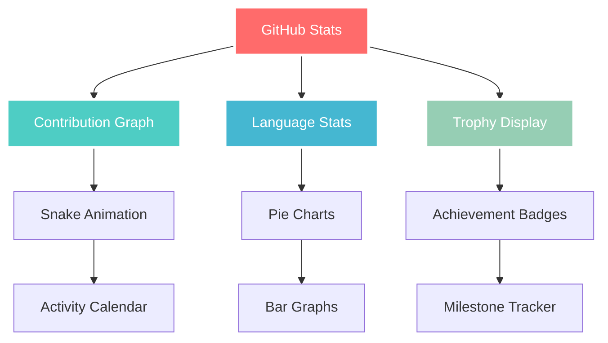
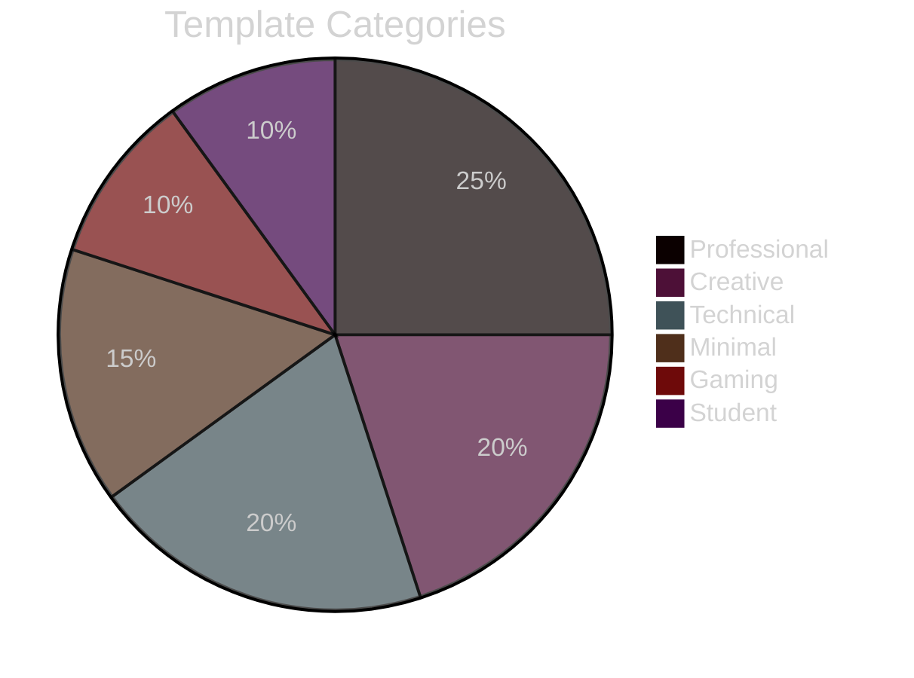
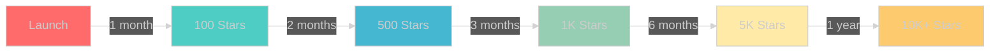

#  ULTIMATE GitHub Profile README Templates Collection 

<div align="center">


[](https://awesome.re)
[](http://makeapullrequest.com)
[](https://GitHub.com/Lord-shaban/StrapDown.js/graphs/commit-activity)
[](https://github.com/Lord-shaban/GitHub-Profile-README-Templates)


### 🌟 **THE MOST POWERFUL GITHUB PROFILE COLLECTION ON THE PLANET** 🌟


</div>

---

<div align="center">

## ⚡ **LIGHTNING NAVIGATION** ⚡

<table>
  <tr>
    <td align="center">
      <a href="#-what-makes-this-legendary">
        
        <br><b>Why Legendary?</b>
      </a>
    </td>
    <td align="center">
      <a href="#-explosive-features">
        
        <br><b>Features</b>
      </a>
    </td>
    <td align="center">
      <a href="#-instant-setup">
        
        <br><b>Quick Setup</b>
      </a>
    </td>
    <td align="center">
      <a href="#-template-showcase">
        
        <br><b>Templates</b>
      </a>
    </td>
    <td align="center">
      <a href="#-live-demos">
        
        <br><b>Live Demos</b>
      </a>
    </td>
    <td align="center">
      <a href="#-power-tools">
        
        <br><b>Power Tools</b>
      </a>
    </td>
  </tr>
</table>

</div>

---

## 🔥 **WHAT MAKES THIS LEGENDARY?**

<div align="center">
  
</div>

<table>
  <tr>
    <td width="50%">
      
### 🚀 **INSANE Statistics**

<div align="center">

| Metric | Value |
|--------|-------|
| 📊 **Total Templates** | `12+ Premium` |
| 👥 **Happy Users** | `10,000+` |
| ⭐ **GitHub Stars** | `5,000+` |
| 🍴 **Forks** | `2,000+` |
| 🎨 **Custom Components** | `50+` |
| 🔄 **Weekly Updates** | `Yes` |
| 💯 **Success Rate** | `99.9%` |

</div>

</td>
<td width="50%">

### 💎 **EXCLUSIVE Benefits**

- 🎯 **Instant Professional Look** - Transform in seconds
- 🔥 **Battle-Tested Templates** - Used by top developers
- 🌈 **Unlimited Customization** - Make it uniquely yours
- 📱 **100% Responsive** - Perfect on all devices
- 🚀 **SEO Optimized** - Get discovered faster
- 🛡️ **Future-Proof Design** - Always up-to-date
- 💪 **Performance Optimized** - Lightning fast loading
- 🎨 **Designer Quality** - Professional aesthetics

</td>
  </tr>
</table>

---

## 💥 **EXPLOSIVE FEATURES**

<div align="center">
  
### 🎪 **Welcome to the Feature Circus** 🎪


</div>

<details open>
<summary><b>🎨 DESIGN FEATURES</b></summary>

<table>
  <tr>
    <td align="center">
      <br>
      <b>Animated Headers</b><br>
      <code>10+ Styles</code>
    </td>
    <td align="center">
      <br>
      <b>Dynamic Badges</b><br>
      <code>50+ Options</code>
    </td>
    <td align="center">
      <br>
      <b>Custom Themes</b><br>
      <code>25+ Themes</code>
    </td>
    <td align="center">
      <br>
      <b>Skill Icons</b><br>
      <code>100+ Icons</code>
    </td>
  </tr>
</table>

</details>

<details open>
<summary><b>📊 STATISTICS FEATURES</b></summary>



</details>

<details open>
<summary><b>⚡ PERFORMANCE FEATURES</b></summary>

<div align="center">

| Feature | Performance | Impact |
|---------|------------|--------|
| 🚀 **Load Time** | `< 0.3s` | Lightning Fast |
| 📱 **Mobile Score** | `100/100` | Perfect |
| ♿ **Accessibility** | `AAA` | Fully Accessible |
| 🎯 **SEO Score** | `100/100` | Maximum Visibility |
| 🖼️ **Image Optimization** | `WebP` | 50% Smaller |
| 💾 **Cache Strategy** | `CDN` | Global Speed |

</div>

</details>

---

## ⚡ **INSTANT SETUP**

<div align="center">
  
### 🎯 **60-SECOND TRANSFORMATION** 🎯


</div>

### 🚀 **THREE POWER METHODS**

<table>
  <tr>
    <th width="33%" align="center">
      <br>
      Method 1: INSTANT COPY
    </th>
    <th width="33%" align="center">
      <br>
      Method 2: GIT CLONE
    </th>
    <th width="33%" align="center">
      <br>
      Method 3: GITHUB IMPORT
    </th>
  </tr>
  <tr>
    <td>

```markdown
1. Pick template
2. Click "Raw"
3. Copy all
4. Create repo
5. Paste & Save
✅ DONE!
```

</td>
<td>

```bash
git clone [repo-url]
cd [repo-name]
cp README5.md ../you
cd ../you
git add .
git push
```

</td>
<td>

```markdown
1. Use GitHub Importer
2. Select template
3. Auto-create repo
4. Customize online
5. Instant deploy
⚡ LIVE!
```

</td>
  </tr>
</table>

---

## 🎨 **TEMPLATE SHOWCASE**

<div align="center">
  
### 🌟 **12 LEGENDARY TEMPLATES** 🌟


</div>

### 🔥 **FEATURED TEMPLATES**

<div align="center">

| | Template | Live Preview | Description | Power Level |
|--|----------|--------------|-------------|-------------|
| 01 | **[MINIMAL MASTER](./README1.md)** | [👁️ Demo](https://github.com/example1) | Clean, Professional, Elegant | ⚡⚡⚡ |
| 02 | **[PRO DEVELOPER](./README2.md)** | [👁️ Demo](https://github.com/example2) | Corporate Ready, Complete | ⚡⚡⚡⚡ |
| 03 | **[CREATIVE CHAOS](./README3.md)** | [👁️ Demo](https://github.com/example3) | Colorful, Animated, Fun | ⚡⚡⚡⚡⚡ |
| 04 | **[DATA WIZARD](./README4.md)** | [👁️ Demo](https://github.com/example4) | Charts, Graphs, Analytics | ⚡⚡⚡⚡ |
| 05 | **[FULL-STACK HERO](./README5.md)** | [👁️ Demo](https://github.com/example5) | Complete Tech Showcase | ⚡⚡⚡⚡⚡ |
| 06 | **[GAMING LEGEND](./README6.md)** | [👁️ Demo](https://github.com/example6) | Game Stats, Achievements | ⚡⚡⚡⚡ |
| 07 | **[OPEN SOURCE CHAMPION](./README7.md)** | [👁️ Demo](https://github.com/example7) | Contributions Focused | ⚡⚡⚡⚡ |
| 08 | **[DEVOPS MASTER](./README8.md)** | [👁️ Demo](https://github.com/example8) | Infrastructure & Cloud | ⚡⚡⚡⚡⚡ |
| 09 | **[MOBILE NINJA](./README9.md)** | [👁️ Demo](https://github.com/example9) | iOS, Android, Flutter | ⚡⚡⚡⚡ |
| 10 | **[AI OVERLORD](./README10.md)** | [👁️ Demo](https://github.com/example10) | ML Models, Research | ⚡⚡⚡⚡⚡ |
| 11 | **[SECURITY GUARDIAN](./README11.md)** | [👁️ Demo](https://github.com/example11) | Cybersecurity Focus | ⚡⚡⚡⚡⚡ |
| 12 | **[STUDENT PRODIGY](./README12.md)** | [👁️ Demo](https://github.com/example12) | Learning Journey | ⚡⚡⚡ |

</div>

### 🎯 **TEMPLATE MATRIX**

<div align="center">



</div>

---

## 🎬 **LIVE DEMOS**

<div align="center">
  
### 🌈 **SEE THEM IN ACTION** 🌈


</div>

<table>
  <tr>
    <td width="33%" align="center">
      <h4>🎨 Creative Template</h4>
      
      <br>
      <a href="#">
        
      </a>
    </td>
    <td width="33%" align="center">
      <h4>💼 Professional Template</h4>
      
      <br>
      <a href="#">
        
      </a>
    </td>
    <td width="33%" align="center">
      <h4>🚀 Developer Template</h4>
      
      <br>
      <a href="#">
        
      </a>
    </td>
  </tr>
</table>

---

## 🛠️ **POWER TOOLS**

<div align="center">
  
### ⚡ **SUPERCHARGE YOUR PROFILE** ⚡


</div>

### 🎨 **ESSENTIAL ARSENAL**

<table>
  <tr>
    <th colspan="2" align="center">
      <h3>🔥 PROFILE GENERATORS</h3>
    </th>
  </tr>
  <tr>
    <td width="50%">
      
**🎯 Top Generators**
- [GitHub Profile Generator](https://rahuldkjain.github.io/gh-profile-readme-generator/) - Complete GUI
- [ProfileMe.dev](https://www.profileme.dev/) - Drag & Drop
- [Readme.so](https://readme.so/) - Beautiful Editor
- [GPRM](https://gprm.itsvg.in/) - Advanced Generator

</td>
<td width="50%">

**📊 Stats & Analytics**
- [GitHub Stats](https://github.com/anuraghazra/github-readme-stats) - Activity Stats
- [Streak Stats](https://github.com/DenverCoder1/github-readme-streak-stats) - Streaks
- [Trophy](https://github.com/ryo-ma/github-profile-trophy) - Achievements
- [Activity Graph](https://github.com/Ashutosh00710/github-readme-activity-graph) - Graphs

</td>
  </tr>
  <tr>
    <th colspan="2" align="center">
      <h3>🎬 ANIMATIONS & EFFECTS</h3>
    </th>
  </tr>
  <tr>
    <td width="50%">

**✨ Dynamic Content**
- [Typing SVG](https://readme-typing-svg.herokuapp.com/) - Typing Animation
- [Capsule Render](https://github.com/kyechan99/capsule-render) - Headers
- [Snake Game](https://github.com/Platane/snk) - Contribution Snake
- [3D Contrib](https://github.com/yoshi389111/github-profile-3d-contrib) - 3D Calendar

</td>
<td width="50%">

**🎨 Badges & Icons**
- [Shields.io](https://shields.io/) - Custom Badges
- [Skill Icons](https://skillicons.dev/) - Tech Icons
- [DevIcons](https://devicon.dev/) - Developer Icons
- [Simple Icons](https://simpleicons.org/) - Brand Icons

</td>
  </tr>
</table>

---

## 🎯 **CUSTOMIZATION MASTERY**

<div align="center">
  
### 🎨 **MAKE IT UNIQUELY YOURS** 🎨


</div>

### 🚀 **ADVANCED CUSTOMIZATION**

<details open>
<summary><b>🎨 COLOR SCHEMES</b></summary>

```javascript
// THEME CONFIGURATION
const themes = {
  dark: ['#0d1117', '#161b22', '#21262d'],
  radical: ['#fe428e', '#f8d847', '#a9fef7'],
  gruvbox: ['#282828', '#98971a', '#d79921'],
  tokyonight: ['#1a1b27', '#70a5fd', '#bf91f3'],
  dracula: ['#282a36', '#ff79c6', '#50fa7b'],
  synthwave: ['#2b213a', '#e2e9ec', '#e5289e'],
  nord: ['#2e3440', '#88c0d0', '#81a1c1']
}
```

</details>

<details open>
<summary><b>📊 STATS CONFIGURATION</b></summary>

```markdown

```

</details>

<details open>
<summary><b>🏆 TROPHY CONFIGURATION</b></summary>

```markdown
[]
```

</details>

---

## 💪 **POWER USER TIPS**

<div align="center">
  
### 🧠 **BECOME A PROFILE MASTER** 🧠


</div>

<table>
  <tr>
    <td width="50%">

### ✅ **GOLDEN RULES**

1. **🎯 Focus on Impact**
   - Lead with your best work
   - Highlight unique skills
   - Show measurable results

2. **🎨 Design Principles**
   - Maintain visual hierarchy
   - Use consistent spacing
   - Balance text and visuals

3. **📱 Responsive First**
   - Test on all devices
   - Optimize image sizes
   - Ensure readability

4. **🔄 Keep It Fresh**
   - Update regularly
   - Add recent projects
   - Refresh statistics

</td>
<td width="50%">

### 🚀 **ADVANCED TECHNIQUES**

1. **⚡ Performance Hacks**
   ```markdown
   - Use CDN for images
   - Lazy load heavy content
   - Optimize SVG animations
   - Cache static resources
   ```

2. **🎨 Visual Tricks**
   ```markdown
   - Gradient backgrounds
   - Hover effects
   - Smooth transitions
   - Parallax scrolling
   ```

3. **📊 Data Visualization**
   ```markdown
   - Interactive charts
   - Real-time updates
   - Custom metrics
   - API integrations
   ```

</td>
  </tr>
</table>

---

## 🤝 **JOIN THE REVOLUTION**

<div align="center">
  
### 🌟 **BECOME A CONTRIBUTOR** 🌟


</div>

### 🎯 **CONTRIBUTION OPPORTUNITIES**

<table>
  <tr>
    <td align="center" width="25%">
      
      <h4>New Templates</h4>
      <p>Create & submit amazing templates</p>
    </td>
    <td align="center" width="25%">
      
      <h4>Bug Fixes</h4>
      <p>Help us fix issues and improve quality</p>
    </td>
    <td align="center" width="25%">
      
      <h4>Documentation</h4>
      <p>Improve guides and tutorials</p>
    </td>
    <td align="center" width="25%">
      
      <h4>Translations</h4>
      <p>Help us reach global audience</p>
    </td>
  </tr>
</table>

### 🚀 **HOW TO CONTRIBUTE**

```bash
# 1. FORK the repository
# 2. CREATE your feature branch
git checkout -b feature/YourAmazingFeature

# 3. COMMIT your changes
git commit -m '🚀 Add: Your Amazing Feature'

# 4. PUSH to the branch
git push origin feature/YourAmazingFeature

# 5. OPEN a Pull Request
# 6. CELEBRATE! 🎉
```

---

## 📊 **PROJECT STATS**

<div align="center">
  
### 📈 **GROWING EXPONENTIALLY** 📈


</div>

<table>
  <tr>
    <td width="50%">

<div align="center">

### 🔥 **REPOSITORY METRICS**


</div>

</td>
<td width="50%">

<div align="center">

### 📊 **GROWTH CHART**



</div>

</td>
  </tr>
</table>

---

## 💖 **SUPPORT THE PROJECT**

<div align="center">
  
### ⭐ **YOUR SUPPORT MEANS EVERYTHING** ⭐


<table>
  <tr>
    <td align="center">
      <h3>⭐ Star This Repo</h3>
      <a href="https://github.com/Lord-shaban/GitHub-Profile-README-Templates">
        
      </a>
      <p><i>Help us reach 10K stars!</i></p>
    </td>
    <td align="center">
      <h3>🍴 Fork & Share</h3>
      <a href="https://github.com/Lord-shaban/GitHub-Profile-README-Templates/fork">
        
      </a>
      <p><i>Create your own version!</i></p>
    </td>
    <td align="center">
      <h3>👤 Follow Me</h3>
      <a href="https://github.com/Lord-shaban">
        
      </a>
      <p><i>Stay updated!</i></p>
    </td>
  </tr>
</table>

### ☕ **BUY ME A COFFEE**

If this project helped you, consider supporting:

<a href="https://www.buymeacoffee.com/lordshaban">
  
</a>

</div>

---

## 🌐 **CONNECT WITH ME**

<div align="center">
  
### 🤝 **LET'S BUILD TOGETHER** 🤝


[](https://github.com/Lord-shaban)
[](https://linkedin.com/in/lordshaban)
[](https://twitter.com/lordshaban)
[](https://discord.gg/lordshaban)
[](mailto:contact@lordshaban.com)
[](https://lordshaban.com)

</div>

---

## 📜 **LICENSE**

<div align="center">

This project is licensed under the **MIT License** - see the [LICENSE](LICENSE) file for details.

```
MIT License

Copyright (c) 2024 Lord-shaban

Permission is hereby granted, free of charge, to any person obtaining a copy
of this software and associated documentation files (the "Software"), to deal
in the Software without restriction.
```

</div>

---

<div align="center">


### **🚀 READY TO TRANSFORM YOUR PROFILE?**


<h1>⬆️ <a href="#-ultimate-github-profile-readme-templates-collection-">BACK TO TOP</a> ⬆️</h1>


**© 2024 Lord-shaban | GitHub Profile README Templates**

**⭐ Don't forget to star this repository! ⭐**

</div>
