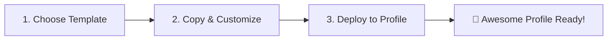
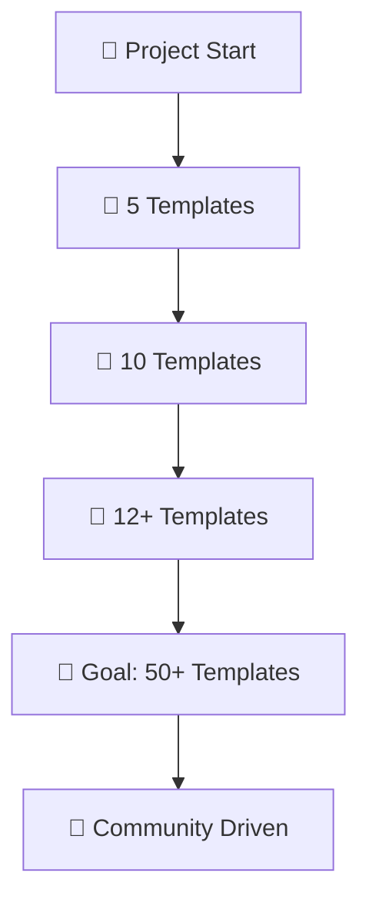

# 🚀 Awesome GitHub Profile README Templates Collection

<div align="center">


### ⭐ Give it a star if you find it useful! ⭐

[🚀 Quick Start](#-quick-start) • [🎨 Templates](#-available-templates) • [📖 Documentation](#-documentation) • [🤝 Contributing](#-contributing)

</div>

---

## 📌 Table of Contents

- [🌟 Overview](#-overview)
- [✨ Features](#-features)
- [🎯 Why This Repository?](#-why-this-repository)
- [📂 Repository Structure](#-repository-structure)
- [🚀 Quick Start](#-quick-start)
- [🎨 Available Templates](#-available-templates)
- [🛠️ Customization Guide](#️-customization-guide)
- [💡 Pro Tips](#-pro-tips)
- [🔧 Useful Tools & Resources](#-useful-tools--resources)
- [🤝 Contributing](#-contributing)
- [📜 License](#-license)
- [💖 Support](#-support)
- [📞 Connect](#-connect)

---

## 🌟 Overview

<div align="center">
  
**Welcome to the Ultimate Collection of GitHub Profile README Templates! 🔥**

Transform your GitHub profile from ordinary to **EXTRAORDINARY** in seconds!

</div>

This repository is a **treasure trove** containing **12+ professionally designed** GitHub Profile README templates that will make your profile **stand out** and leave a lasting impression on visitors!

### 🎭 What Makes This Special?

```markdown
📊 12+ Ready-to-Use Templates
🎨 Modern & Creative Designs
🌍 Suitable for All Developer Types
⚡ Easy to Customize
🔥 Regular Updates with New Templates
💎 100% Free & Open Source
🚀 Instant Profile Upgrade
```

---

## ✨ Features

<table>
<tr>
<td width="50%">

### 🎯 Template Varieties
- 👨‍💻 **Developer-Focused**: Technical & Professional
- 🎨 **Creative Designs**: Colorful & Eye-catching
- 📊 **Data-Driven**: Stats & Analytics Heavy
- 🎮 **Gaming Theme**: For Gaming Enthusiasts
- 🌟 **Minimalist**: Clean & Simple
- 🚀 **Dynamic**: Animated & Interactive

</td>
<td width="50%">

### 🛠️ Components Included
- 📈 **GitHub Stats Cards**
- 🏆 **Trophy Displays**
- 🐍 **Contribution Snakes**
- 💻 **Tech Stack Badges**
- 📫 **Contact Sections**
- 🎯 **Project Showcases**

</td>
</tr>
</table>

---

## 🎯 Why This Repository?

<div align="center">

| Reason | Description |
|--------|-------------|
| 🚀 **Speed** | Get a stunning profile in under 60 seconds |
| 🎨 **Beauty** | Professional designs that catch attention |
| 📱 **Responsive** | Looks great on all devices |
| 🔧 **Flexibility** | Easy to customize to your needs |
| 📚 **Variety** | Templates for every developer type |
| 🆕 **Fresh** | Updated with latest trends |
| 🌟 **Quality** | Carefully crafted templates |

</div>

---

## 📂 Repository Structure

```
📦 GitHub-Profile-README-Templates/
┣ 📄 README.md          # Main template (You are here!)
┣ 📄 README1.md         # Minimal Clean Design
┣ 📄 README2.md         # Professional Developer
┣ 📄 README3.md         # Creative & Colorful
┣ 📄 README4.md         # Data Scientist Special
┣ 📄 README5.md         # Full-Stack Developer
┣ 📄 README6.md         # Gaming Enthusiast
┣ 📄 README7.md         # Open Source Contributor
┣ 📄 README8.md         # DevOps Engineer
┣ 📄 README9.md         # Mobile Developer
┣ 📄 README10.md        # AI/ML Engineer
┣ 📄 README11.md        # Cybersecurity Expert
┗ 📄 README12.md        # Student Developer
```

---

## 🚀 Quick Start

### ⚡ Lightning Fast Setup (3 Steps!)

<div align="center">



</div>

### 📋 Detailed Instructions

#### Method 1: Quick Copy & Paste 🏃‍♂️

1. **Browse** the templates (README1.md - README12.md)
2. **Choose** your favorite template
3. **Copy** the raw content
4. **Create** a repository named `your-github-username`
5. **Paste** content into `README.md`
6. **Customize** with your information
7. **Commit** and watch the magic! ✨

#### Method 2: Fork & Customize 🍴

```bash
# 1. Fork this repository
# Click the Fork button at the top right

# 2. Clone your fork
git clone https://github.com/your-username/GitHub-Profile-README-Templates.git

# 3. Choose your template
cd GitHub-Profile-README-Templates
cp README5.md ../your-username/README.md

# 4. Edit with your information
cd ../your-username
nano README.md

# 5. Push to GitHub
git add README.md
git commit -m "✨ Add awesome profile README"
git push origin main
```

---

## 🎨 Available Templates

### 📊 Template Showcase

<details>
<summary><b>📄 Template 1 - Minimal Clean</b> (README1.md)</summary>

**Perfect for:** Developers who prefer simplicity  
**Features:** Clean layout, essential information, subtle animations  
**Style:** Minimalist, Professional  

```markdown
✅ Simple header
✅ Brief introduction
✅ Tech stack badges
✅ GitHub stats
✅ Contact information
```

[View Template](./README1.md)

</details>

<details>
<summary><b>📄 Template 2 - Professional Developer</b> (README2.md)</summary>

**Perfect for:** Senior developers, team leads  
**Features:** Comprehensive sections, professional tone  
**Style:** Corporate, Structured  

```markdown
✅ Professional header
✅ Detailed about section
✅ Skills matrix
✅ Project highlights
✅ Achievement badges
```

[View Template](./README2.md)

</details>

<details>
<summary><b>📄 Template 3 - Creative & Colorful</b> (README3.md)</summary>

**Perfect for:** Creative developers, designers  
**Features:** Vibrant colors, animations, unique layout  
**Style:** Artistic, Eye-catching  

```markdown
✅ Animated header
✅ Colorful badges
✅ Creative sections
✅ Fun facts
✅ Interactive elements
```

[View Template](./README3.md)

</details>

<details>
<summary><b>📄 Template 4 - Data Scientist</b> (README4.md)</summary>

**Perfect for:** Data scientists, ML engineers  
**Features:** Data visualizations, research focus  
**Style:** Academic, Data-driven  

```markdown
✅ Research interests
✅ Publications section
✅ Data visualization
✅ Kaggle achievements
✅ Technical skills
```

[View Template](./README4.md)

</details>

<details>
<summary><b>📄 Template 5 - Full-Stack Developer</b> (README5.md)</summary>

**Perfect for:** Full-stack developers  
**Features:** Frontend & backend skills, project showcase  
**Style:** Comprehensive, Technical  

```markdown
✅ Full tech stack
✅ Frontend/Backend split
✅ Live project demos
✅ Code snippets
✅ Development workflow
```

[View Template](./README5.md)

</details>

### 📋 Complete Template List

| Template | Best For | Style | Features | Link |
|----------|----------|-------|----------|------|
| **README1** | Minimalists | Clean & Simple | Essential Info | [View](./README1.md) |
| **README2** | Professionals | Corporate | Comprehensive | [View](./README2.md) |
| **README3** | Creatives | Colorful | Animated | [View](./README3.md) |
| **README4** | Data Scientists | Academic | Data-focused | [View](./README4.md) |
| **README5** | Full-Stack | Technical | Complete Stack | [View](./README5.md) |
| **README6** | Gamers | Gaming Theme | Fun Elements | [View](./README6.md) |
| **README7** | Open Source | Community | Contributions | [View](./README7.md) |
| **README8** | DevOps | Infrastructure | Tools & Cloud | [View](./README8.md) |
| **README9** | Mobile Dev | App-focused | Platform Specific | [View](./README9.md) |
| **README10** | AI/ML | Research | Models & Papers | [View](./README10.md) |
| **README11** | Security | Cybersecurity | Security Tools | [View](./README11.md) |
| **README12** | Students | Learning | Education Focus | [View](./README12.md) |

---

## 🛠️ Customization Guide

### 🎨 Essential Customization Points

#### 1️⃣ **Personal Information**
```markdown
- Name
- Title/Role
- Location
- Bio/Description
```

#### 2️⃣ **Social Links**
```markdown
- LinkedIn
- Twitter
- Portfolio
- Email
```

#### 3️⃣ **Tech Stack**
```markdown
- Programming Languages
- Frameworks
- Tools
- Databases
```

#### 4️⃣ **GitHub Stats**
```markdown
- Replace 'yourusername' with your GitHub username
- Choose your preferred theme
- Select which stats to display
```

### 🎯 Advanced Customization

<details>
<summary><b>🎨 Color Themes</b></summary>

```markdown
Popular GitHub Stats Themes:
- dark
- radical
- merko
- gruvbox
- tokyonight
- onedark
- cobalt
- synthwave
- highcontrast
- dracula
```

</details>

<details>
<summary><b>📊 Stats Cards Options</b></summary>

```markdown
&show_icons=true
&count_private=true
&include_all_commits=true
&hide_border=true
&hide_title=true
&hide_rank=false
&show_owner=true
&theme=radical
```

</details>

<details>
<summary><b>🏆 Trophy Themes</b></summary>

```markdown
?theme=onedark
?theme=gruvbox
?theme=dracula
?theme=monokai
?theme=chalk
?theme=nord
?theme=alduin
```

</details>

---

## 💡 Pro Tips

### 🏆 Creating an Unforgettable Profile

1. **🎯 Be Concise**: Keep it short and impactful
2. **🎨 Use Visuals**: Images and badges attract attention
3. **📊 Show Stats**: Numbers speak louder than words
4. **🔗 Working Links**: Ensure all links are functional
5. **📱 Mobile-Friendly**: Test on different devices
6. **🔄 Stay Updated**: Keep information current
7. **⭐ Be Authentic**: Let your personality shine
8. **🎬 Add GIFs**: Motion catches the eye (but don't overdo it)
9. **🌈 Color Balance**: Use colors that complement each other
10. **📝 Proofread**: Check for typos and grammar

### ⚠️ Common Mistakes to Avoid

- ❌ **Outdated Information**: Last updated in 2019?
- ❌ **Broken Links**: 404 errors are embarrassing
- ❌ **Too Many GIFs**: This isn't MySpace
- ❌ **Wall of Text**: Nobody reads essays
- ❌ **Inconsistent Style**: Pick a theme and stick to it
- ❌ **Missing Contact Info**: How will people reach you?
- ❌ **No Call-to-Action**: What do you want visitors to do?

---

## 🔧 Useful Tools & Resources

### 🎨 Generators & Editors

| Tool | Description | Link |
|------|-------------|------|
| **GitHub Profile README Generator** | GUI-based generator | [🔗 Visit](https://rahuldkjain.github.io/gh-profile-readme-generator/) |
| **Readme.so** | Beautiful editor | [🔗 Visit](https://readme.so/) |
| **Typing SVG** | Animated typing text | [🔗 Visit](https://readme-typing-svg.herokuapp.com/) |
| **Shields.io** | Custom badges | [🔗 Visit](https://shields.io/) |
| **GitHub Stats** | Statistics cards | [🔗 Visit](https://github.com/anuraghazra/github-readme-stats) |
| **Trophy Generator** | GitHub trophies | [🔗 Visit](https://github.com/ryo-ma/github-profile-trophy) |
| **Contribution Snake** | Snake animation | [🔗 Visit](https://github.com/Platane/snk) |
| **Activity Graph** | Contribution graph | [🔗 Visit](https://github.com/Ashutosh00710/github-readme-activity-graph) |
| **Visitor Badge** | Visitor counter | [🔗 Visit](https://visitor-badge.glitch.me/) |
| **DevIcons** | Technology icons | [🔗 Visit](https://devicon.dev/) |
| **Skill Icons** | Beautiful skill badges | [🔗 Visit](https://skillicons.dev/) |
| **Streak Stats** | Contribution streaks | [🔗 Visit](https://github.com/DenverCoder1/github-readme-streak-stats) |

### 📚 Inspiration Sources

- 🌟 [Awesome GitHub Profile README](https://github.com/abhisheknaiidu/awesome-github-profile-readme)
- 💡 [ProfileMe.dev](https://www.profileme.dev/)
- 🎨 [GitHub Profile Examples](https://github.com/coderjojo/creative-profile-readme)
- 📊 [GitHub Wrapped](https://githubwrapped.tech/)

### 🎓 Learning Resources

- 📖 [Markdown Guide](https://www.markdownguide.org/)
- 🎥 [GitHub Profile Tutorial](https://www.youtube.com/results?search_query=github+profile+readme)
- 📝 [GitHub Docs](https://docs.github.com/en/account-and-profile/setting-up-and-managing-your-github-profile/customizing-your-profile/managing-your-profile-readme)

---

## 🤝 Contributing

### We Welcome All Contributions! 🎉

Have an awesome template? A cool feature? Or found a bug? Let's make this repository even better together!

#### 📝 How to Contribute:

1. **🍴 Fork** the repository
2. **🌿 Create** your feature branch (`git checkout -b feature/AmazingTemplate`)
3. **✏️ Make** your changes
4. **✅ Test** your template thoroughly
5. **📝 Commit** your changes (`git commit -m '✨ Add Amazing Template'`)
6. **🚀 Push** to the branch (`git push origin feature/AmazingTemplate`)
7. **🎯 Open** a Pull Request

### 📋 Contribution Guidelines:

- ✅ **Original Content**: No plagiarism
- ✅ **Clean Code**: Well-formatted markdown
- ✅ **Responsive**: Works on all screen sizes
- ✅ **Documentation**: Clear instructions
- ✅ **Testing**: Verify all links and features work

### 🎁 What Can You Contribute?

- 🆕 New templates
- 🐛 Bug fixes
- 📝 Documentation improvements
- 🎨 Design enhancements
- 🌐 Translations
- 💡 Feature suggestions
- ⭐ Star the repository!

---

## 📜 License

<div align="center">

📄 This project is licensed under the **MIT License**

You are free to use, modify, and distribute this project!

[View Full License](./LICENSE)

```
MIT License

Copyright (c) 2024 Lord-shaban

Permission is hereby granted, free of charge, to any person obtaining a copy
of this software and associated documentation files (the "Software"), to deal
in the Software without restriction...
```

</div>

---

## 💖 Support

### If you find this repository helpful, please consider:

<div align="center">

[](https://github.com/Lord-shaban/GitHub-Profile-README-Templates)
[](https://github.com/Lord-shaban/GitHub-Profile-README-Templates/fork)
[](https://github.com/Lord-shaban)

### 💰 Buy Me a Coffee

If you want to support the development:

[](https://www.buymeacoffee.com/lordshaban)
[](https://paypal.me/lordshaban)

</div>

---

## 📞 Connect

<div align="center">

### 💬 Have questions? Suggestions? Or just want to say hi?

[](https://github.com/Lord-shaban)
[](https://linkedin.com/in/lordshaban)
[](https://twitter.com/lordshaban)
[](mailto:lordshaban@example.com)

### 🔔 Stay Updated

Watch this repository to get notified about new templates!

[](https://github.com/Lord-shaban/GitHub-Profile-README-Templates/subscription)

</div>

---

## 📊 Repository Stats

<div align="center">


### 📈 Growth Timeline



</div>

---

## 🎬 Final Words

<div align="center">

### 🚀 **Don't Just Code. Stand Out!**

Your GitHub profile is your digital identity in the developer world.  
Make it count with these amazing templates!

**Every ⭐ star motivates us to create more awesome templates!**


### Made with ❤️ and lots of ☕ coffee

**© 2024 Lord-shaban - GitHub Profile README Templates**

---

### 🔝 [Back to Top](#-awesome-github-profile-readme-templates-collection)

</div>
