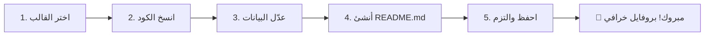
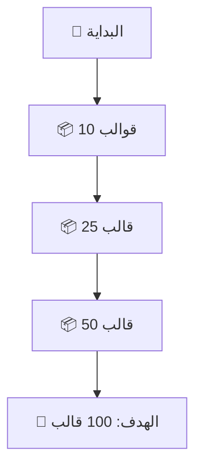

# 🚀 GitHub Profile README Templates | قوالب ريدمي احترافية للبروفايل

<div align="center">


### ⭐ إذا أعجبك المشروع، لا تنسى النجمة! ⭐

[📖 English Version](#english) | [🇸🇦 النسخة العربية](#arabic)

</div>

---

## 📌 جدول المحتويات

- [🌟 نظرة عامة](#-نظرة-عامة)
- [✨ المميزات الخرافية](#-المميزات-الخرافية)
- [🎯 لماذا هذا الريبو؟](#-لماذا-هذا-الريبو)
- [📂 محتويات المشروع](#-محتويات-المشروع)
- [🚀 كيفية الاستخدام](#-كيفية-الاستخدام)
- [🎨 القوالب المتاحة](#-القوالب-المتاحة)
- [💡 نصائح ذهبية](#-نصائح-ذهبية)
- [🛠️ أدوات مفيدة](#️-أدوات-مفيدة)
- [🤝 المساهمة](#-المساهمة)
- [📜 الرخصة](#-الرخصة)
- [🌟 المساهمون](#-المساهمون)
- [📞 تواصل معنا](#-تواصل-معنا)

---

## 🌟 نظرة عامة

<div align="center">
  
**مرحباً بك في أقوى مكتبة قوالب GitHub Profile README في العالم العربي! 🔥**

</div>

هذا المشروع عبارة عن **كنز حقيقي** يحتوي على مجموعة **أسطورية** من قوالب README الجاهزة التي ستحول بروفايلك على GitHub من عادي إلى **خرافي** في ثوانٍ معدودة! 

### 🎭 ما الذي يجعل هذا المشروع مميزاً؟

```markdown
📊 +50 قالب جاهز للاستخدام
🎨 تصاميم عصرية ومبتكرة
🌍 دعم كامل للغة العربية والإنجليزية
⚡ سهولة التخصيص والتعديل
🔥 تحديثات مستمرة بأحدث التقنيات
💎 مجاني 100% ومفتوح المصدر
```

---

## ✨ المميزات الخرافية

<table>
<tr>
<td width="50%">

### 🎯 قوالب متنوعة
- 👨‍💻 **للمطورين**: قوالب تقنية احترافية
- 🎨 **للمصممين**: قوالب إبداعية وملونة
- 📊 **للمحللين**: قوالب بيانات وإحصائيات
- 🎮 **للجيمرز**: قوالب ألعاب ممتعة
- 📚 **للطلاب**: قوالب أكاديمية منظمة

</td>
<td width="50%">

### 🛠️ مكونات جاهزة
- 📈 **GitHub Stats**: إحصائيات ديناميكية
- 🏆 **Trophies**: جوائز وإنجازات
- 🐍 **Contribution Snake**: ثعبان المساهمات
- 💻 **Tech Stack**: شارات التقنيات
- 📫 **Contact Sections**: أقسام التواصل

</td>
</tr>
</table>

---

## 🎯 لماذا هذا الريبو؟

<div align="center">

| السبب | الوصف |
|-------|-------|
| 🚀 **السرعة** | جاهز للاستخدام في أقل من دقيقة |
| 🎨 **الجمال** | تصاميم احترافية تخطف الأنظار |
| 📱 **التجاوب** | متوافق مع جميع الأجهزة |
| 🔧 **المرونة** | سهل التخصيص حسب احتياجاتك |
| 📚 **التنوع** | قوالب لجميع التخصصات |
| 🌟 **الحداثة** | محدث بأحدث الترندات |

</div>

---

## 📂 محتويات المشروع

```
📦 GitHub-Profile-README-Templates/
┣ 📂 templates/
┃ ┣ 📂 minimal/         # قوالب بسيطة وأنيقة
┃ ┣ 📂 creative/        # قوالب إبداعية ومجنونة
┃ ┣ 📂 professional/    # قوالب احترافية للعمل
┃ ┣ 📂 animated/        # قوالب متحركة وديناميكية
┃ ┣ 📂 gaming/          # قوالب للجيمرز
┃ ┣ 📂 data-science/    # قوالب لعلماء البيانات
┃ ┗ 📂 students/        # قوالب للطلاب
┣ 📂 components/
┃ ┣ 📄 headers.md       # هيدرات جاهزة
┃ ┣ 📄 stats.md         # إحصائيات GitHub
┃ ┣ 📄 badges.md        # شارات وأيقونات
┃ ┣ 📄 social.md        # روابط التواصل
┃ ┗ 📄 animations.md    # عناصر متحركة
┣ 📂 resources/
┃ ┣ 📄 tools.md         # أدوات مساعدة
┃ ┣ 📄 colors.md        # ألوان وثيمات
┃ ┗ 📄 icons.md         # أيقونات ورموز
┣ 📄 README.md          # أنت هنا! 
┣ 📄 README-en.md       # English Version
┗ 📄 LICENSE            # رخصة MIT
```

---

## 🚀 كيفية الاستخدام

### 📋 الخطوات السحرية

<div align="center">



</div>

### 🔥 طريقة سريعة (Copy & Paste)

1. **اختر القالب المناسب** من مجلد `templates/`
2. **انسخ محتوى القالب** بالكامل
3. **أنشئ ملف** `README.md` في ريبو يحمل اسم المستخدم الخاص بك
4. **الصق المحتوى** وعدّل البيانات الشخصية
5. **احفظ التغييرات** وشاهد السحر! ✨

### 💻 طريقة المحترفين (Git Clone)

```bash
# 1. استنسخ المشروع
git clone https://github.com/yourusername/GitHub-Profile-README-Templates.git

# 2. انتقل للمجلد
cd GitHub-Profile-README-Templates

# 3. اختر قالبك المفضل
cp templates/creative/template-1.md ~/your-username/README.md

# 4. عدّل بياناتك
nano ~/your-username/README.md

# 5. ارفع التغييرات
cd ~/your-username
git add README.md
git commit -m "🎨 Add awesome profile README"
git push origin main
```

---

## 🎨 القوالب المتاحة

### 🌟 القوالب المميزة

<details>
<summary><b>🔥 القالب الناري - Fire Template</b></summary>

```markdown
<!-- مثال على القالب الناري -->
# 🔥 مرحباً، أنا [اسمك] 

<div align="center">
  
</div>

## 🚀 عني
مطور متحمس شغوف بالتقنية والبرمجة...

## 💻 التقنيات


## 📊 إحصائياتي

```

</details>

<details>
<summary><b>💎 القالب الماسي - Diamond Template</b></summary>

```markdown
<!-- مثال على القالب الماسي -->
<div align="center">
  
# 💎 Welcome to My Profile 💎

### 👨‍💻 Full Stack Developer | 🎨 UI/UX Enthusiast | 🚀 Tech Explorer


</div>

<!-- إضافة المزيد من المحتوى هنا -->
```

</details>

<details>
<summary><b>🌊 القالب المائي - Ocean Template</b></summary>

```markdown
<!-- مثال على القالب المائي -->
<h1 align="center">
  
  مرحباً، أنا [اسمك]
  
</h1>

<!-- إضافة المزيد من المحتوى هنا -->
```

</details>

### 📊 جدول القوالب الكامل

| النوع | الوصف | المستوى | الرابط |
|------|-------|---------|--------|
| 🎯 **Minimal** | قوالب بسيطة وأنيقة | مبتدئ | [عرض](./templates/minimal/) |
| 🎨 **Creative** | قوالب إبداعية ملونة | متوسط | [عرض](./templates/creative/) |
| 💼 **Professional** | قوالب احترافية للعمل | متقدم | [عرض](./templates/professional/) |
| 🎮 **Gaming** | قوالب للجيمرز | ممتع | [عرض](./templates/gaming/) |
| 📊 **Data Science** | قوالب لعلماء البيانات | متخصص | [عرض](./templates/data-science/) |
| 🎓 **Students** | قوالب للطلاب | أكاديمي | [عرض](./templates/students/) |
| ⚡ **Animated** | قوالب متحركة | ديناميكي | [عرض](./templates/animated/) |

---

## 💡 نصائح ذهبية

### 🏆 لبروفايل لا يُنسى

1. **🎯 كن مختصراً**: لا تكتب روايات، اجعلها قصيرة ومفيدة
2. **🎨 استخدم الألوان**: الألوان تجذب الانتباه ولكن لا تبالغ
3. **📊 أضف الإحصائيات**: الأرقام تتحدث أكثر من الكلمات
4. **🔗 روابط نشطة**: تأكد من أن جميع الروابط تعمل
5. **📱 تجاوب الشاشات**: تأكد من أن البروفايل يظهر جيداً على الموبايل
6. **🔄 حدّث باستمرار**: أبقِ معلوماتك محدثة دائماً
7. **⭐ كن أصلياً**: لا تنسخ، كن نفسك!

### 🚫 أخطاء شائعة يجب تجنبها

- ❌ **معلومات قديمة**: تحديث آخر مرة 2019 😅
- ❌ **روابط معطلة**: Error 404 محرج جداً
- ❌ **إفراط في GIFs**: ليس TikTok هنا!
- ❌ **ألوان مزعجة**: عيوننا ليست للتجارب
- ❌ **نص طويل جداً**: نحن في عصر السرعة

---

## 🛠️ أدوات مفيدة

### 🎨 مولدات ومحررات

| الأداة | الوصف | الرابط |
|--------|-------|--------|
| **Readme Typing SVG** | نص متحرك رائع | [🔗](https://readme-typing-svg.herokuapp.com/) |
| **GitHub Stats Card** | بطاقات الإحصائيات | [🔗](https://github.com/anuraghazra/github-readme-stats) |
| **Shields.io** | شارات مخصصة | [🔗](https://shields.io/) |
| **Profile Trophy** | جوائز GitHub | [🔗](https://github.com/ryo-ma/github-profile-trophy) |
| **Contribution Snake** | ثعبان المساهمات | [🔗](https://github.com/Platane/snk) |
| **Activity Graph** | رسم بياني للنشاط | [🔗](https://github.com/Ashutosh00710/github-readme-activity-graph) |
| **Visitor Badge** | عداد الزوار | [🔗](https://visitor-badge.glitch.me/) |
| **Dev Icons** | أيقونات التقنيات | [🔗](https://devicon.dev/) |

### 📚 مصادر للإلهام

- 🌟 [Awesome GitHub Profile README](https://github.com/abhisheknaiidu/awesome-github-profile-readme)
- 💡 [GitHub Profile README Generator](https://rahuldkjain.github.io/gh-profile-readme-generator/)
- 🎨 [Profileme.dev](https://www.profileme.dev/)
- 📊 [GitHub Wrapped](https://githubwrapped.tech/)

---

## 🤝 المساهمة

### نحن نرحب بمساهماتك! 🎉

هل لديك قالب رائع؟ أو فكرة مجنونة؟ شاركنا إياها!

#### 📝 خطوات المساهمة:

1. **Fork** المشروع 🍴
2. **أنشئ فرع** جديد (`git checkout -b feature/AmazingTemplate`)
3. **أضف تغييراتك** وتأكد من جودتها
4. **Commit** تغييراتك (`git commit -m '✨ Add Amazing Template'`)
5. **Push** للفرع (`git push origin feature/AmazingTemplate`)
6. **افتح Pull Request** وانتظر المراجعة 🚀

### 📋 معايير القبول:

- ✅ القالب أصلي وليس منسوخ
- ✅ الكود نظيف ومنظم
- ✅ يعمل على جميع المتصفحات
- ✅ متجاوب مع الشاشات المختلفة
- ✅ موثق بشكل جيد

---

## 📜 الرخصة

<div align="center">

📄 هذا المشروع مرخص تحت رخصة **MIT License**

يمكنك استخدامه، نسخه، تعديله، وتوزيعه بحرية كاملة! 

[اقرأ الرخصة الكاملة](./LICENSE)

</div>

---

## 🌟 المساهمون

<div align="center">

### شكراً لكل من ساهم في جعل هذا المشروع أفضل! ❤️

<!-- ALL-CONTRIBUTORS-LIST:START -->
<table>
  <tr>
    <td align="center">
      <a href="https://github.com/yourusername">
        
        <br />
        <sub><b>اسمك</b></sub>
      </a>
      <br />
      💻 📖 🎨
    </td>
    <!-- إضافة المزيد من المساهمين هنا -->
  </tr>
</table>
<!-- ALL-CONTRIBUTORS-LIST:END -->

### 🎯 كن التالي في القائمة!

</div>

---

## 📊 إحصائيات المشروع

<div align="center">


### 📈 نمو المشروع



</div>

---

## 📞 تواصل معنا

<div align="center">

### 💬 هل لديك سؤال؟ اقتراح؟ أو تريد فقط أن تقول مرحباً؟

[](mailto:your-email@example.com)
[](https://twitter.com/yourusername)
[](https://linkedin.com/in/yourusername)
[](https://discord.gg/yourserver)

### 🌐 تابعنا للحصول على آخر التحديثات!

[](https://github.com/yourusername)
[](https://twitter.com/yourusername)

</div>

---

## 🎬 كلمة أخيرة

<div align="center">

### 🚀 **لا تكن مجرد مبرمج عادي، كن أسطورة!**

إذا وصلت إلى هنا، فأنت رائع! 🎉

لا تنسَ أن تضع ⭐ للمشروع إذا أعجبك!

**كل نجمة = دافع أكبر لإضافة المزيد من القوالب الخرافية!** 


### صُنع بـ ❤️ و ☕ كثير من القهوة

**© 2024 GitHub Profile README Templates - جميع الحقوق محفوظة**

</div>

---

<div align="center">

### 🔙 [العودة للأعلى](#-github-profile-readme-templates--قوالب-ريدمي-احترافية-للبروفايل)

</div>
