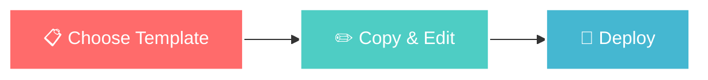

#  Awesome GitHub Profile README Templates

<div align="center">
  
  
  
  <p align="center">
    <a href="https://github.com/Lord-shaban/GitHub-Profile-README-Templates/stargazers">
      
    </a>
    <a href="https://github.com/Lord-shaban/GitHub-Profile-README-Templates/network/members">
      
    </a>
    <a href="https://github.com/Lord-shaban/GitHub-Profile-README-Templates/blob/main/LICENSE">
      
    </a>
    <a href="https://github.com/Lord-shaban/GitHub-Profile-README-Templates">
      
    </a>
  </p>

  <p align="center">
    <b>Transform your GitHub profile from ordinary to extraordinary in under 60 seconds!</b>
  </p>
  
  <h3>
    <a href="#-quick-start">Quick Start</a> •
    <a href="#-templates-gallery">Templates</a> •
    <a href="#-how-to-use">How to Use</a> •
    <a href="#-tools">Tools</a> •
    <a href="#-support">Support</a>
  </h3>
  
  
  
</div>

## 🎯 What is This?

<table>
  <tr>
    <td width="60%">
      <h3>📦 A Complete Collection of GitHub Profile Templates</h3>
      <p>This repository contains <b>12+ professionally designed</b> GitHub Profile README templates that are:</p>
      <ul>
        <li>✅ Ready to use immediately</li>
        <li>✅ Easy to customize</li>
        <li>✅ Mobile responsive</li>
        <li>✅ SEO optimized</li>
        <li>✅ Regularly updated</li>
      </ul>
    </td>
    <td width="40%">
      
    </td>
  </tr>
</table>

## ⚡ Quick Start

<div align="center">
  
### 🚀 **Get Your Awesome Profile in 3 Simple Steps**

</div>



### Step-by-Step Guide:

<details open>
<summary><b>📋 Step 1: Choose Your Template</b></summary>

Browse through our [Templates Gallery](#-templates-gallery) and pick the one that matches your style.

</details>

<details open>
<summary><b>✏️ Step 2: Copy & Customize</b></summary>

1. Click on your chosen template file (README1.md - README12.md)
2. Click the "Raw" button
3. Copy all the content
4. Replace placeholder text with your information

</details>

<details open>
<summary><b>🚀 Step 3: Deploy to Your Profile</b></summary>

1. Create a new repository named **exactly** as your GitHub username
2. Create a `README.md` file
3. Paste your customized template
4. Commit and push!

</details>

## 🎨 Templates Gallery

<div align="center">
  
### **Choose Your Perfect Template**

</div>

| Preview | Template | Description | Best For | Features |
|---------|----------|-------------|----------|----------|
|  | [**README1.md**](./README1.md)<br>**Minimal Clean** | Simple and elegant design with essential information | Minimalists | `Stats` `Skills` `Contact` |
|  | [**README2.md**](./README2.md)<br>**Professional** | Corporate-ready profile with comprehensive sections | Senior Devs | `Portfolio` `Experience` `Skills Matrix` |
|  | [**README3.md**](./README3.md)<br>**Creative** | Colorful and animated design | Designers | `Animations` `Colors` `Fun Facts` |
|  | [**README4.md**](./README4.md)<br>**Data Science** | Data-focused with visualizations | Data Scientists | `Charts` `Research` `Publications` |
|  | [**README5.md**](./README5.md)<br>**Full-Stack** | Complete tech stack showcase | Full-Stack Devs | `Frontend` `Backend` `Databases` |
|  | [**README6.md**](./README6.md)<br>**Gaming** | Gaming-themed profile | Game Devs | `Game Stats` `Achievements` `Fun` |
|  | [**README7.md**](./README7.md)<br>**Open Source** | Contribution-focused | Contributors | `PRs` `Issues` `Projects` |
|  | [**README8.md**](./README8.md)<br>**DevOps** | Infrastructure and tools | DevOps Engineers | `Cloud` `CI/CD` `Monitoring` |
|  | [**README9.md**](./README9.md)<br>**Mobile Dev** | App development focused | Mobile Devs | `iOS` `Android` `Flutter` |
|  | [**README10.md**](./README10.md)<br>**AI/ML** | Machine learning themed | ML Engineers | `Models` `Research` `Kaggle` |
|  | [**README11.md**](./README11.md)<br>**Security** | Cybersecurity focused | Security Experts | `Tools` `Certs` `CVEs` |
|  | [**README12.md**](./README12.md)<br>**Student** | Perfect for students | Students | `Learning` `Projects` `Goals` |

## 🎯 How to Use

<div align="center">
  
### **Two Methods: Choose What Works for You**

</div>

<table>
  <tr>
    <th width="50%">🏃 Method 1: Quick Copy</th>
    <th width="50%">👨‍💻 Method 2: Git Clone</th>
  </tr>
  <tr>
    <td>

**For Beginners - No Git Required!**

1. Click template file
2. Click "Raw" button
3. Select all (`Ctrl+A`)
4. Copy (`Ctrl+C`)
5. Create your profile repo
6. Paste and customize
7. Save and commit!

</td>
<td>

**For Developers - Using Terminal**

```bash
# Clone repository
git clone https://github.com/Lord-shaban/GitHub-Profile-README-Templates.git

# Navigate to folder
cd GitHub-Profile-README-Templates

# Copy template
cp README5.md ~/username/README.md

# Edit and push
git add .
git commit -m "✨ Add profile"
git push
```

</td>
  </tr>
</table>

## 🛠️ Customization Guide

<div align="center">
  
### **Make It Yours in Minutes**

</div>

### 📝 What to Replace:

<table>
  <tr>
    <td width="33%">
      
**🔤 Text Content**
- Your Name
- Job Title
- Bio/About
- Location
- Interests

</td>
<td width="33%">

**🔗 Links**
- GitHub username
- Social media URLs
- Portfolio website
- Email address
- Blog/Medium

</td>
<td width="34%">

**🎨 Visuals**
- Profile image
- Banner image
- Color themes
- Badge styles
- Icons

</td>
  </tr>
</table>

### 🎨 Theme Customization:

<details>
<summary><b>📊 GitHub Stats Themes</b></summary>

Change the `theme` parameter in stats cards:

```markdown

```

**Popular Themes:**
- `radical` - Vibrant pink/blue
- `dark` - Dark mode
- `gruvbox` - Retro orange
- `tokyonight` - Purple/blue
- `dracula` - Dark purple
- `synthwave` - Retro wave
- `cobalt` - Deep blue
- `onedark` - Atom inspired

</details>

<details>
<summary><b>🏆 Trophy Themes</b></summary>

```markdown
[]
```

**Available Themes:**
- `onedark`
- `gruvbox`
- `dracula`
- `monokai`
- `chalk`
- `nord`

</details>

## 🧰 Tools

<div align="center">
  
### **Essential Tools for Amazing Profiles**

</div>

### 🎨 **Profile Generators**

| Tool | Description | Link |
|------|-------------|------|
| **Profile Generator** | Complete GUI generator | [Visit →](https://rahuldkjain.github.io/gh-profile-readme-generator/) |
| **Readme.so** | Beautiful editor | [Visit →](https://readme.so/) |
| **ProfileMe** | Easy customization | [Visit →](https://www.profileme.dev/) |

### 📊 **Stats & Badges**

| Tool | Description | Link |
|------|-------------|------|
| **GitHub Stats** | Activity statistics | [Visit →](https://github.com/anuraghazra/github-readme-stats) |
| **Shields.io** | Custom badges | [Visit →](https://shields.io/) |
| **Streak Stats** | Contribution streaks | [Visit →](https://github.com/DenverCoder1/github-readme-streak-stats) |
| **Trophy** | Achievement trophies | [Visit →](https://github.com/ryo-ma/github-profile-trophy) |

### 🎬 **Animations**

| Tool | Description | Link |
|------|-------------|------|
| **Typing SVG** | Animated typing | [Visit →](https://readme-typing-svg.herokuapp.com/) |
| **Snake Game** | Contribution snake | [Visit →](https://github.com/Platane/snk) |
| **Activity Graph** | Contribution graph | [Visit →](https://github.com/Ashutosh00710/github-readme-activity-graph) |

### 🎯 **Icons & Images**

| Tool | Description | Link |
|------|-------------|------|
| **Skill Icons** | Tech stack icons | [Visit →](https://skillicons.dev/) |
| **DevIcons** | Developer icons | [Visit →](https://devicon.dev/) |
| **Simple Icons** | Brand icons | [Visit →](https://simpleicons.org/) |

## 💡 Pro Tips

<div align="center">
  
### **Level Up Your Profile Game**

</div>

<table>
  <tr>
    <td width="50%">
      
### ✅ **DO's**

- ✨ Keep it concise and focused
- 🎨 Use consistent color scheme
- 📱 Test on mobile devices
- 🔗 Include contact information
- 📊 Show real statistics
- 🆕 Update regularly
- 🎯 Highlight best projects
- 📝 Use proper grammar

</td>
<td width="50%">

### ❌ **DON'Ts**

- 🚫 Don't use too many GIFs
- 🚫 Avoid walls of text
- 🚫 Don't leave broken links
- 🚫 Avoid inconsistent styling
- 🚫 Don't share sensitive info
- 🚫 Avoid offensive content
- 🚫 Don't copy without credit
- 🚫 Avoid outdated information

</td>
  </tr>
</table>

## 🤝 Contributing

<div align="center">
  
### **Help Us Grow This Collection!**

We welcome contributions of all kinds! Here's how you can help:

</div>

<table>
  <tr>
    <td width="33%" align="center">
      
**🆕 Add Templates**

Submit your creative templates via Pull Request

</td>
<td width="33%" align="center">

**🐛 Report Issues**

Found a bug? Open an issue to let us know

</td>
<td width="34%" align="center">

**⭐ Star & Share**

Give us a star and share with friends!

</td>
  </tr>
</table>

### How to Contribute:

```bash
1. Fork the repository
2. Create your branch: git checkout -b new-template
3. Add your template: README13.md
4. Commit changes: git commit -m '✨ Add new template'
5. Push to branch: git push origin new-template
6. Open Pull Request
```

## 💖 Support

<div align="center">
  
### **If This Helped You, Consider Supporting**

<a href="https://github.com/Lord-shaban/GitHub-Profile-README-Templates">
  
</a>

<a href="https://github.com/Lord-shaban/GitHub-Profile-README-Templates/fork">
  
</a>

<a href="https://github.com/Lord-shaban">
  
</a>

### **Every star ⭐ motivates us to add more templates!**

</div>

## 📞 Connect

<div align="center">
  
### **Let's Connect and Build Together**

[](https://github.com/Lord-shaban)
[](https://linkedin.com/in/lordshaban)
[](https://twitter.com/lordshaban)
[](mailto:contact@lordshaban.com)

</div>

## 📄 License

<div align="center">
  
This project is licensed under the **MIT License** - see the [LICENSE](LICENSE) file for details.

You're free to use, modify, and distribute these templates!

</div>

---

<div align="center">
  


**Made with ❤️ by [Lord-shaban](https://github.com/Lord-shaban)**

### [⬆ Back to Top](#-awesome-github-profile-readme-templates)

</div>
