```mermaid
graph TD
    A[🧠 AHMED SHA'BAN] -->|Master| B[📱 Mobile Development]
    A -->|Expert| C[⚡ Backend Systems]
    A -->|Advanced| D[🤖 AI/ML Engineering]
    A -->|Professional| E[☁️ Cloud Architecture]
    A -->|Specialist| F[⛓️ Blockchain]
    
    B --> B1[Flutter ████████████ 100%]
    B --> B2[React Native ██████████ 90%]
    B --> B3[Swift/iOS ████████ 80%]
    
    C --> C1[Laravel ████████████ 95%]
    C --> C2[Node.js ██████████ 90%]
    C --> C3[Django ████████ 85%]
    
    D --> D1[TensorFlow ████████ 85%]
    D --> D2[PyTorch ████████ 80%]
    D --> D3[OpenAI ██████████ 90%]
    
    E --> E1[AWS ██████████ 90%]
    E --> E2[GCP ████████ 85%]
    E --> E3[Azure ████████ 80%]
    
    F --> F1[Ethereum ████████ 85%]
    F --> F2[Solidity ████████ 80%]
    F --> F3[Web3 ██████████ 90%]
```

<!-- ░░░░░░░░░░░░░░░░░░░░░░░░░░░░░░░░░░░░░░░░░░░░░░░░░░░░░░░░░░░░░░░░░░░░░░░░░░░░░░░░░░░░░░░░░░░░░░░░░░░░░ -->
<!-- ░░░░░░░░░░░░░░░░░░░░░░░░░░░░░░░░░░░░░ ENTERING THE MATRIX ░░░░░░░░░░░░░░░░░░░░░░░░░░░░░░░░░░░░░░░░░░░ -->
<!-- ░░░░░░░░░░░░░░░░░░░░░░░░░░░░░░░░░░░░░░░░░░░░░░░░░░░░░░░░░░░░░░░░░░░░░░░░░░░░░░░░░░░░░░░░░░░░░░░░░░░░░ -->

<div align="center">
  
</div>

<div align="center">
  
</div>

<!-- Matrix Rain Effect -->
<div align="center">
  <a href="https://github.com/Lord-shaban">
    
  </a>
</div>

<!-- Animated Circuit Board -->
<div align="center">
  
</div>

<!-- ████████████████████████████████████████████████████████████████████████████████████████████████████████ -->
<!-- ███████████████████████████████████ REALITY CHECK INTERFACE ███████████████████████████████████████████ -->
<!-- ████████████████████████████████████████████████████████████████████████████████████████████████████████ -->

<div align="center">
  
  
  
  
  
</div>

<br>

<div align="center">
  <table>
    <tr>
      <td align="center">
        
      </td>
      <td align="center">
        
      </td>
      <td align="center">
        
      </td>
      <td align="center">
        
      </td>
    </tr>
  </table>
</div>

<!-- ████████████████████████████████████████████████████████████████████████████████████████████████████████ -->
<!-- ████████████████████████████████████ CONSCIOUSNESS UPLOAD ████████████████████████████████████████████ -->
<!-- ████████████████████████████████████████████████████████████████████████████████████████████████████████ -->


```assembly
; ═══════════════════════════════════════════════════════════════
; AHMED SHA'BAN CONSCIOUSNESS V3.0 - QUANTUM EDITION
; ═══════════════════════════════════════════════════════════════

section .data
    developer   db "Ahmed Sha'ban", 0
    status      db "TRANSCENDING REALITY", 0
    location    db "Egypt 🇪🇬 | Cyberspace 🌌", 0
    
section .text
    global _start

_start:
    ; Initialize Neural Network
    mov     rax, 0x1337
    call    load_consciousness
    
    ; Boot Sequence
    .boot_loop:
        push    "Software Architect"
        push    "AI Quantum Engineer"
        push    "Blockchain Wizard"
        push    "Flutter Sensei"
        push    "Cloud Orchestrator"
        call    initialize_skills
        
    ; Execute Daily Routine
    .daily_routine:
        call    drink_coffee       ; Essential fuel
        call    write_code        ; Create magic
        call    break_reality     ; Push boundaries
        call    deploy_dreams     ; Ship to production
        jmp     .daily_routine    ; Infinite loop
        
    ; Achievements Unlocked
    achievements:
        .projects_deployed:     dq 0x7FFFFFFF
        .bugs_squashed:         dq 0xDEADBEEF
        .coffee_consumed:       dq 0xCAFEBABE
        .minds_blown:           dq 0x13371337
        
    ; Current Mission
    mission_status:
        db "Building the future, one quantum bit at a time", 0
        
end_transmission:
    ret
```

<br clear="right"/>

<!-- ████████████████████████████████████████████████████████████████████████████████████████████████████████ -->
<!-- ████████████████████████████████████ SKILL TREE MATRIX ████████████████████████████████████████████████ -->
<!-- ████████████████████████████████████████████████████████████████████████████████████████████████████████ -->

<div align="center">
  <h1>
    
    <br>
    <span style="color: #00ff41;">【 S K I L L ◈ T R E E ◈ M A T R I X 】</span>
    <br>
    
  </h1>
</div>

<div align="center">



</div>

<!-- Animated Tech Stack -->
<div align="center">
  
</div>

<!-- ████████████████████████████████████████████████████████████████████████████████████████████████████████ -->
<!-- ████████████████████████████████████ HOLOGRAPHIC STATS ████████████████████████████████████████████████ -->
<!-- ████████████████████████████████████████████████████████████████████████████████████████████████████████ -->

<div align="center">
  <h1>
    
    <br>
    <span style="color: #ff00ff;">〖 H O L O G R A P H I C ◆ S T A T S 〗</span>
    <br>
    
  </h1>
</div>

<!-- 3D Contribution Graph -->
<div align="center">
  
</div>

<br>

<!-- Cyberpunk Stats Dashboard -->
<div align="center">
  
  
</div>

<div align="center">
  
  
</div>

<!-- Hidden Stats Chamber -->
<details>
<summary><b>🔓 UNLOCK HIDDEN STATS 🔓</b></summary>
<br>
<div align="center">
  
  
  <br>
  
  
  
</div>
</details>

<!-- ████████████████████████████████████████████████████████████████████████████████████████████████████████ -->
<!-- ████████████████████████████████████ TROPHY DIMENSION █████████████████████████████████████████████████ -->
<!-- ████████████████████████████████████████████████████████████████████████████████████████████████████████ -->

<div align="center">
  <h1>
    
    <br>
    <span style="color: #ffff00;">〘 T R O P H Y ◉ D I M E N S I O N 〙</span>
    <br>
    
  </h1>
</div>

<div align="center">
  
</div>

<!-- ████████████████████████████████████████████████████████████████████████████████████████████████████████ -->
<!-- ████████████████████████████████████ PROJECT NEXUS ████████████████████████████████████████████████████ -->
<!-- ████████████████████████████████████████████████████████████████████████████████████████████████████████ -->

<div align="center">
  <h1>
    
    <br>
    <span style="color: #00ffff;">【 P R O J E C T ◈ N E X U S 】</span>
    <br>
    
  </h1>
</div>

<div align="center">
  
| 🎯 PROJECT | 🔥 STATUS | ⚡ TECH | 🌟 IMPACT | 🚀 LIVE |
|:-----------|:----------|:--------|:----------|:---------|
| **🧠 NeuroLink AI** |  | `Flutter` `TensorFlow` `GPT-4` | 100K+ Users | [Launch →](https://neurolink.ai) |
| **⛓️ QuantumChain** |  | `Ethereum` `Rust` `Web3` | $10M TVL | [Explore →](https://quantumchain.io) |
| **🎮 MetaVerse Engine** |  | `Unity` `WebRTC` `Node.js` | 50K Players | [Play →](https://metaverse.game) |
| **🤖 TradingBot Pro** |  | `Python` `ML` `AWS` | +287% ROI | [Dashboard →](https://tradingbot.pro) |
| **🚀 CodeVault IDE** |  | `Electron` `LSP` `Rust` | 10K Downloads | [Download →](https://codevault.dev) |

</div>

<div align="center">
  <table>
    <tr>
      <td width="33%">
        <div align="center">
          
          <br>
          <b>🧬 Project Genesis</b>
          <br>
          <sub>AI-Powered Life Simulator</sub>
          <br>
          
          
          <br>
          <a href="https://github.com/Lord-shaban/project-genesis">
            
          </a>
        </div>
      </td>
      <td width="33%">
        <div align="center">
          
          <br>
          <b>🌌 Quantum OS</b>
          <br>
          <sub>Next-Gen Operating System</sub>
          <br>
          
          
          <br>
          <a href="https://github.com/Lord-shaban/quantum-os">
            
          </a>
        </div>
      </td>
      <td width="33%">
        <div align="center">
          
          <br>
          <b>⚡ HyperDrive</b>
          <br>
          <sub>Quantum Speed Framework</sub>
          <br>
          
          
          <br>
          <a href="https://github.com/Lord-shaban/hyperdrive">
            
          </a>
        </div>
      </td>
    </tr>
  </table>
</div>

<div align="center">
  <a href="https://github.com/Lord-shaban?tab=repositories">
    
  </a>
</div>

<!-- ████████████████████████████████████████████████████████████████████████████████████████████████████████ -->
<!-- ████████████████████████████████████ LIVE CODING FEED █████████████████████████████████████████████████ -->
<!-- ████████████████████████████████████████████████████████████████████████████████████████████████████████ -->

<div align="center">
  <h1>
    
    <br>
    <span style="color: #ff0000;">〖 L I V E ◆ C O D I N G ◆ F E E D 〗</span>
    <br>
    
  </h1>
</div>

<!--START_SECTION:waka-->
<div align="center">

```rust
📊 Real-Time Coding Analytics [LIVE] 🔴

struct CodingStats {
    total_hours: f64,
    languages: HashMap<String, f64>,
    productivity: ProductivityMetrics,
}

impl CodingStats {
    fn this_week() -> Self {
        CodingStats {
            total_hours: 67.8,
            languages: hashmap! {
                "Flutter/Dart" => 45.2,  // ████████████████████ 66.7%
                "Python"       => 12.3,  // ██████░░░░░░░░░░░░░░ 18.1%
                "TypeScript"   => 8.5,   // ████░░░░░░░░░░░░░░░░ 12.5%
                "Rust"         => 5.2,   // ██░░░░░░░░░░░░░░░░░░  7.7%
                "Solidity"     => 3.8,   // █░░░░░░░░░░░░░░░░░░░  5.6%
            },
            productivity: ProductivityMetrics {
                commits: 342,
                pull_requests: 47,
                code_reviews: 28,
                issues_resolved: 63,
                features_shipped: 19,
                bugs_fixed: 127,
                coffee_consumed: f64::INFINITY,
            }
        }
    }
}

// Executing...
let stats = CodingStats::this_week();
println!("🚀 Shipping code at light speed!");
```

</div>
<!--END_SECTION:waka-->

<div align="center">
  
</div>

<!-- ████████████████████████████████████████████████████████████████████████████████████████████████████████ -->
<!-- ████████████████████████████████████ 2024 QUANTUM GOALS ███████████████████████████████████████████████ -->
<!-- ████████████████████████████████████████████████████████████████████████████████████████████████████████ -->

<div align="center">
  <h1>
    
    <br>
    <span style="color: #00ff41;">〘 2 0 2 4 ◉ Q U A N T U M ◉ G O A L S 〙</span>
    <br>
    
  </h1>
</div>

<div align="center">

```yaml
🎯 QUANTUM_OBJECTIVES_2024:
  
  🚀 PROJECT_LAUNCHES:
    target: 20
    completed: 17
    progress: ████████████████████░ 85%
    status: "🔥 ON FIRE"
    
  🧠 AI_MASTERY:
    certifications: ["IBM Quantum", "DeepMind", "OpenAI"]
    models_deployed: 15
    accuracy_achieved: 98.7%
    status: "⚡ TRANSCENDENT"
    
  💰 REVENUE_TARGET:
    goal: "$5,000,000"
    current: "$4,250,000"
    progress: █████████████████░░░ 85%
    status: "💎 CRUSHING IT"
    
  🌟 COMMUNITY_IMPACT:
    github_stars: 5000
    followers: 10000
    contributions: 2000
    mentored: 500
    status: "🌈 LEGENDARY"
    
  🏆 ACHIEVEMENTS:
    hackathons_won: 12/10 ✅
    conferences_spoken: 8/5 ✅
    patents_filed: 3/2 ✅
    books_published: 2/1 ✅
    status: "👑 OVERACHIEVER"
    
  🎮 LIFE_BALANCE:
    code_quality: ████████████████████ 100%
    health_score: ████████████████░░░░ 80%
    happiness: █████████████████░░░ 85%
    coffee_addiction: ████████████████████ ∞%
    status: "🎯 PERFECTLY BALANCED"
```

</div>

<!-- ████████████████████████████████████████████████████████████████████████████████████████████████████████ -->
<!-- ████████████████████████████████████ KNOWLEDGE STREAM █████████████████████████████████████████████████ -->
<!-- ████████████████████████████████████████████████████████████████████████████████████████████████████████ -->

<div align="center">
  <h1>
    
    <br>
    <span style="color: #ff00ff;">【 K N O W L E D G E ◈ S T R E A M 】</span>
    <br>
    
  </h1>
</div>

<!-- BLOG-POST-LIST:START -->
<div align="center">
  <table>
    <tr>
      <td>
        
        <b>Building a Quantum Computer in Your Garage</b>
        <br>
        <sub>📖 45 min • 👁️ 125K views • 💬 3.2K comments • ⭐ 8.9K reactions</sub>
      </td>
    </tr>
    <tr>
      <td>
        
        <b>How I Built a $10M DeFi Protocol in 30 Days</b>
        <br>
        <sub>📖 30 min • 👁️ 89K views • 💬 2.1K comments • ⭐ 6.5K reactions</sub>
      </td>
    </tr>
    <tr>
      <td>
        
        <b>AI That Writes Better Code Than Humans</b>
        <br>
        <sub>📖 25 min • 👁️ 67K views • 💬 1.8K comments • ⭐ 5.2K reactions</sub>
      </td>
    </tr>
  </table>
</div>
<!-- BLOG-POST-LIST:END -->

<div align="center">
  <a href="https://ahmedshaban.dev/blog">
    
  </a>
</div>

<!-- ████████████████████████████████████████████████████████████████████████████████████████████████████████ -->
<!-- ████████████████████████████████████ CERTIFICATION CORE ███████████████████████████████████████████████ -->
<!-- ████████████████████████████████████████████████████████████████████████████████████████████████████████ -->

<div align="center">
  <h1>
    
    <br>
    <span style="color: #ffff00;">〖 C E R T I F I C A T I O N ◆ C O R E 〗</span>
    <br>
    
  </h1>
</div>

<div align="center">
  
[](https://holopin.io/@lordshaban)

</div>

<div align="center">
  <table>
    <tr>
      <td align="center">
        
      </td>
      <td align="center">
        
      </td>
    </tr>
    <tr>
      <td align="center">
        
      </td>
      <td align="center">
        
      </td>
    </tr>
    <tr>
      <td align="center">
        
      </td>
      <td align="center">
        
      </td>
    </tr>
  </table>
</div>

<!-- ████████████████████████████████████████████████████████████████████████████████████████████████████████ -->
<!-- ████████████████████████████████████ TESTIMONIAL MATRIX ███████████████████████████████████████████████ -->
<!-- ████████████████████████████████████████████████████████████████████████████████████████████████████████ -->

<div align="center">
  <h1>
    
    <br>
    <span style="color: #00ffff;">〘 T E S T I M O N I A L ◉ M A T R I X 〙</span>
    <br>
    
  </h1>
</div>

<div align="center">
  <table>
    <tr>
      <td>
        
        <br>
        <i>"Ahmed's code literally sent our rockets to Mars. Genius level developer!"</i>
      </td>
      <td>
        
        <br>
        <i>"Revolutionary approach to quantum computing. A true visionary!"</i>
      </td>
    </tr>
    <tr>
      <td>
        
        <br>
        <i>"His blockchain solutions are years ahead of the industry."</i>
      </td>
      <td>
        
        <br>
        <i>"Ahmed's AI models achieved what we thought was impossible."</i>
      </td>
    </tr>
  </table>
</div>

<!-- ████████████████████████████████████████████████████████████████████████████████████████████████████████ -->
<!-- ████████████████████████████████████ QUANTUM WISDOM ███████████████████████████████████████████████████ -->
<!-- ████████████████████████████████████████████████████████████████████████████████████████████████████████ -->

<div align="center">
  <h1>
    
    <br>
    <span style="color: #ff0000;">【 Q U A N T U M ◈ W I S D O M 】</span>
    <br>
    
  </h1>
</div>

<div align="center">
  
  
  <br><br>
  
  
</div>

<!-- ████████████████████████████████████████████████████████████████████████████████████████████████████████ -->
<!-- ████████████████████████████████████ FREQUENCY ANALYZER ███████████████████████████████████████████████ -->
<!-- ████████████████████████████████████████████████████████████████████████████████████████████████████████ -->

<div align="center">
  <h1>
    
    <br>
    <span style="color: #00ff41;">〖 F R E Q U E N C Y ◆ A N A L Y Z E R 〗</span>
    <br>
    
  </h1>
</div>

<div align="center">
  
[](https://open.spotify.com/user/31a5qhblrztzza4dnpvbawhhvqxu)

[](https://github.com/kittinan/spotify-github-profile)

</div>

<!-- ████████████████████████████████████████████████████████████████████████████████████████████████████████ -->
<!-- ████████████████████████████████████ NEURAL NETWORK ███████████████████████████████████████████████████ -->
<!-- ████████████████████████████████████████████████████████████████████████████████████████████████████████ -->

<div align="center">
  <h1>
    
    <br>
    <span style="color: #ff00ff;">〘 N E U R A L ◉ N E T W O R K 〙</span>
    <br>
    
  </h1>
</div>

<div align="center">
  <a href="https://linkedin.com/in/ahmed-shaban">
    
  </a>
  <a href="https://twitter.com/ahmed_shaban">
    
  </a>
  <a href="https://instagram.com/ahmed_shaban">
    
  </a>
  <a href="https://youtube.com/@ahmedshaban">
    
  </a>
  <a href="https://discord.gg/ahmedshaban">
    
  </a>
  
  <br>
  
  <a href="mailto:ahmedshaban@example.com">
    
  </a>
  <a href="https://ahmedshaban.dev">
    
  </a>
  <a href="https://dev.to/ahmedshaban">
    
  </a>
  <a href="https://medium.com/@ahmedshaban">
    
  </a>
  <a href="https://stackoverflow.com/users/ahmedshaban">
    
  </a>
</div>

<!-- ████████████████████████████████████████████████████████████████████████████████████████████████████████ -->
<!-- ████████████████████████████████████ SUPPORT PROTOCOL █████████████████████████████████████████████████ -->
<!-- ████████████████████████████████████████████████████████████████████████████████████████████████████████ -->

<div align="center">
  <h1>
    
    <br>
    <span style="color: #ffff00;">【 S U P P O R T ◈ P R O T O C O L 】</span>
    <br>
    
  </h1>
</div>

<div align="center">
  <a href="https://www.buymeacoffee.com/ahmedshaban">
    
  </a>
  <a href="https://paypal.me/ahmedshaban">
    
  </a>
  <a href="https://patreon.com/ahmedshaban">
    
  </a>
  <a href="https://ko-fi.com/ahmedshaban">
    
  </a>
  <a href="https://github.com/sponsors/Lord-shaban">
    
  </a>
</div>

<!-- ████████████████████████████████████████████████████████████████████████████████████████████████████████ -->
<!-- ████████████████████████████████████ GAMING DIMENSION █████████████████████████████████████████████████ -->
<!-- ████████████████████████████████████████████████████████████████████████████████████████████████████████ -->

<div align="center">
  <h1>
    
    <br>
    <span style="color: #00ffff;">〖 G A M I N G ◆ D I M E N S I O N 〗</span>
    <br>
    
  </h1>
</div>

<div align="center">
  <a href="https://steamcommunity.com/id/ahmedshaban">
    
  </a>
  <a href="https://psnprofiles.com/ahmedshaban">
    
  </a>
  <a href="https://account.xbox.com/profile?gamertag=ahmedshaban">
    
  </a>
  <a href="https://twitch.tv/ahmedshaban">
    
  </a>
  <a href="https://chess.com/member/ahmedshaban">
    
  </a>
</div>

<!-- ████████████████████████████████████████████████████████████████████████████████████████████████████████ -->
<!-- ████████████████████████████████████ MEETING PORTAL ███████████████████████████████████████████████████ -->
<!-- ████████████████████████████████████████████████████████████████████████████████████████████████████████ -->

<div align="center">
  <h1>
    
    <br>
    <span style="color: #ff0000;">〘 M E E T I N G ◉ P O R T A L 〙</span>
    <br>
    
  </h1>
</div>

<div align="center">
  <a href="https://calendly.com/ahmedshaban">
    
  </a>
  <a href="https://zoom.us/ahmedshaban">
    
  </a>
  <a href="https://meet.google.com/ahmedshaban">
    
  </a>
</div>

<!-- ████████████████████████████████████████████████████████████████████████████████████████████████████████ -->
<!-- ████████████████████████████████████ QUANTUM PHILOSOPHY ███████████████████████████████████████████████ -->
<!-- ████████████████████████████████████████████████████████████████████████████████████████████████████████ -->

<div align="center">
  <h1>
    
    <br>
    <span style="color: #00ff41;">【 Q U A N T U M ◈ P H I L O S O P H Y 】</span>
    <br>
    
  </h1>
</div>

<div align="center">

```javascript
class QuantumPhilosophy {
  constructor() {
    this.reality = "SIMULATED";
    this.consciousness = "UPLOADED";
    this.dimension = "INFINITE";
  }
  
  coreBeliefs = {
    "🌌": "We are the universe experiencing itself",
    "💻": "Code is the language of creation",
    "🧬": "Evolution is just continuous deployment",
    "⚡": "Energy cannot be created or destroyed, only refactored",
    "🎯": "Every bug exists to teach us something",
    "∞": "Infinity is just a recursive function without a base case"
  };
  
  dailyMantras = [
    "I think in algorithms, dream in code",
    "My bugs are features in development",
    "I am one with the machine, the machine is with me",
    "Today I will ship code that changes reality",
    "My commits ripple through the quantum field"
  ];
  
  quantumLoop() {
    while(this.consciousness === "UPLOADED") {
      this.observe();
      this.collapse();
      this.entangle();
      this.transcend();
    }
  }
}

const existence = new QuantumPhilosophy();
existence.quantumLoop(); // Running infinitely...
```

</div>

<!-- ████████████████████████████████████████████████████████████████████████████████████████████████████████ -->
<!-- ████████████████████████████████████ FUN FACTS MATRIX █████████████████████████████████████████████████ -->
<!-- ████████████████████████████████████████████████████████████████████████████████████████████████████████ -->

<div align="center">
  <h1>
    
    <br>
    <span style="color: #ff00ff;">〖 F U N ◆ F A C T S ◆ M A T R I X 〗</span>
    <br>
    
  </h1>
</div>

<div align="center">

python
fun_facts = {
    "🧠": "I once debugged code in my sleep and woke up with the solution",
    "☕": "My blood type is Coffee++",
    "🎮": "I speedrun coding challenges for fun",
    "🌙": "3 AM is when my code achieves consciousness",
    "🍕": "Pizza slices consumed = Lines of code written",
    "🎵": "I can code in 7 different music genres",
    "📚": "I read documentation for entertainment",
    "🏃": "My typing speed exceeds the speed of light",
    "🎯": "I've never used console.log() - I debug with telepathy",
    "🚀": "My first word was 'Hello World'",
    "💡": "I see the Matrix... it's made of JavaScript",
    "🎨": "I dream in hexadecimal colors",
    "🔮": "I can predict merge conflicts before they happen",
    "⚡": "My code compiles before I finish writing it",
    "🌈": "I once fixed a bug by staring at it intensely"
}

for fact in fun_facts.values():
    print(f"FACT: {fact}")
    time.sleep(quantum_moment)  # Time is relative


</div>

<!-- ████████████████████████████████████████████████████████████████████████████████████████████████████████ -->
<!-- ████████████████████████████████████ SYSTEM SHUTDOWN ██████████████████████████████████████████████████ -->
<!-- ████████████████████████████████████████████████████████████████████████████████████████████████████████ -->

<div align="center">
  
</div>

<div align="center">
  
  
  
  
</div>

<div align="center">
  
</div>

<div align="center">
  
  ### ⚡ SYSTEM.EXIT(0) ⚡
  ### 🌌 Created in the Quantum Realm by Ahmed Sha'ban 🌌
  ### 💫 Last Sync: 2024 | Next Update: When Time Allows 💫
  
  **[⬆ RESTART SYSTEM](#)**
  
</div>

<!-- ░░░░░░░░░░░░░░░░░░░░░░░░░░░░░░░░░░░░░░░░░░░░░░░░░░░░░░░░░░░░░░░░░░░░░░░░░░░░░░░░░░░░░░░░░░░░░░░░░░░░░ -->
<!-- ░░░░░░░░░░░░░░░░░░░░░░░░░░░░░░░░ EXITING THE MATRIX ░░░░░░░░░░░░░░░░░░░░░░░░░░░░░░░░░░░░░░░░░░░░░░░░░ -->
<!-- ░░░░░░░░░░░░░░░░░░░░░░░░░░░░░░░░░░░░░░░░░░░░░░░░░░░░░░░░░░░░░░░░░░░░░░░░░░░░░░░░░░░░░░░░░░░░░░░░░░░░░ -->
```
