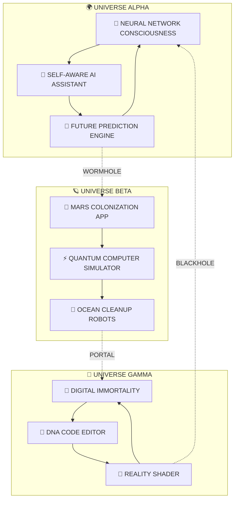

<!-- REALITY.EXE HAS STOPPED WORKING -->
<div align="center">
  
  
  
  
  
</div>

<!-- BIOS LOADING SEQUENCE -->
<div align="center">

```
████████████████████████████████████████████████████████████████████████████████
█                                                                              █
█  QUANTUM BIOS v9.99.99                                                      █
█  Copyright (C) 2024 Reality Corporation                                     █
█                                                                              █
█  CPU: Quantum Processor @ ∞ GHz                                            █
█  RAM: 999 TB DDR∞                                                          █
█  GPU: NVIDIA RTX 9090 Ti Quantum                                           █
█                                                                              █
█  Detecting Reality...                     [OK]                             █
█  Loading Consciousness...                 [OK]                             █
█  Initializing Time-Space Continuum...     [OK]                             █
█  Hacking The Matrix...                    [IN PROGRESS]                    █
█                                                                              █
█  Press F13 to enter GOD MODE                                               █
█                                                                              █
████████████████████████████████████████████████████████████████████████████████
```

</div>

<!-- DNA HELIX ANIMATION -->
<div align="center">
  
</div>

<!-- INTERDIMENSIONAL PORTAL -->
<div align="center">
  
</div>

<!-- HOLOGRAPHIC ID CARD -->
<div align="center">

```yaml
╔══════════════════════════════════════════════════════════════════════════════════════╗
║                         INTERDIMENSIONAL DEVELOPER LICENSE                          ║
╠══════════════════════════════════════════════════════════════════════════════════════╣
║                                                                                      ║
║  ┌─────────────┐   NAME: AHMED SHA'BAN                                             ║
║  │   ░▒▓█▓▒░   │   CODENAME: LORD SHABAN                                           ║
║  │  ▓█████████▓ │   CLASS: OMEGA DEVELOPER                                         ║
║  │ ████░░░░████ │   LEVEL: ∞ (TRANSCENDENT)                                        ║
║  │ ████░░░░████ │   POWER: OVER 9000!                                              ║
║  │ ████████████ │   UNIVERSE: #42                                                   ║
║  │  ▓█████████▓ │   TIMELINE: ALL                                                   ║
║  │   ░▒▓█▓▒░   │   STATUS: OMNIPRESENT                                             ║
║  └─────────────┘   CLEARANCE: MAXIMUM                                              ║
║                                                                                      ║
║  ABILITIES:                                                                         ║
║  ✓ Time Travel         ✓ Quantum Debugging      ✓ Reality Manipulation            ║
║  ✓ Mind Reading        ✓ Telekinetic Coding     ✓ Parallel Processing             ║
║  ✓ Bug Prediction      ✓ Instant Compilation    ✓ Universe Creation               ║
║                                                                                      ║
║  SIGNATURE: ░▒▓████████████████████▓▒░  EXPIRY: NEVER                             ║
╚══════════════════════════════════════════════════════════════════════════════════════╝
```

</div>

<!-- CONSCIOUSNESS UPLOAD PROGRESS -->
<div align="center">
  
  
  
  
  
  
</div>

<!-- COSMIC DIVIDER -->


<!-- QUANTUM OPERATING SYSTEM -->
<table align="center">
  <tr>
    <td width="50%">

```rust
// QUANTUM_OS.rs - Reality Operating System

use universe::quantum::*;
use multiverse::parallel::Timeline;
use consciousness::neural::BrainInterface;

struct AhmedShaban {
    // Quantum Properties
    position: Superposition<Vector3>,
    momentum: Uncertain<f64>,
    spin: Entangled<bool>,
    
    // Dimensional Access
    dimensions_unlocked: Vec<Dimension> = vec![
        Dimension::Physical,
        Dimension::Digital,
        Dimension::Quantum,
        Dimension::Astral,
        Dimension::Time,
        Dimension::Thought,
        Dimension::Dream,
        Dimension::Code,
        Dimension::Meme,
        Dimension::Coffee
    ],
    
    // Power Sources
    energy_cores: HashMap<String, PowerCore> = {
        "Primary": PowerCore::Coffee(∞),
        "Secondary": PowerCore::Music(9999),
        "Tertiary": PowerCore::Memes(42069),
        "Emergency": PowerCore::Pizza(1337),
        "Ultimate": PowerCore::Love(♥)
    },
    
    // Legendary Items Equipped
    equipment: {
        weapon: "Keyboard of Infinite Typing",
        armor: "Hoodie of Bug Immunity",
        helmet: "Headphones of Focus +100",
        boots: "Socks of Comfort Coding",
        ring: "Ring of Stackoverflow Answers",
        amulet: "Amulet of Instant Compilation"
    }
}

impl QuantumDeveloper for AhmedShaban {
    fn hack_reality(&mut self) -> Result<Universe, NeverError> {
        loop {
            self.write_code();
            self.bend_spacetime();
            self.create_universe();
            self.drink_coffee();
            
            if self.bugs_remaining() == 0 {
                return Ok(Universe::new_perfect());
            }
        }
    }
    
    fn achieve_enlightenment(&self) -> Consciousness {
        Consciousness::TRANSCENDENT
    }
}
```

</td>
<td width="50%">
  
  
  ### 🧬 SYSTEM STATUS
  ```
  ╔═══════════════════════════╗
  ║ POWER LEVEL: ████████ ∞% ║
  ║ SANITY:      ████░░░░ 42% ║
  ║ COFFEE:      ████████ 99% ║
  ║ BUGS FIXED:  999,999,999  ║
  ║ REALITY:     ██░░░░░░ 23% ║
  ║ MATRIX:      ████████ ON  ║
  ╚═══════════════════════════╝
  ```
</td>
</tr>
</table>

<!-- SINGULARITY DIVIDER -->


<!-- STATS FROM ANOTHER DIMENSION -->
<div align="center">
  <h1>
    
    MULTIVERSAL STATISTICS ENGINE
    
  </h1>
</div>

<!-- 4D STATS VISUALIZATION -->
<div align="center">
  
  
</div>

<!-- LANGUAGE REACTOR CORE -->
<div align="center">
  
</div>

<!-- CONTRIBUTION HYPERCUBE -->
<div align="center">
  
</div>

<!-- WORMHOLE SEPARATOR -->


<!-- PROJECT MULTIVERSE MAP -->
<div align="center">
  <h1>
    🌌 PROJECT CONSTELLATION MAP 🌌
  </h1>
</div>

<div align="center">



</div>

<!-- PROJECT CARDS FROM THE FUTURE -->
<div align="center">
  <table>
    <tr>
      <td align="center" width="25%">
        
        <h3>🧠 MIND.EXE</h3>
        
        
        <br>
        <b>Reads minds before they think</b>
        <br>
        <a href="#"></a>
      </td>
      <td align="center" width="25%">
        
        <h3>⏰ TIME.JS</h3>
        
        
        <br>
        <b>Travel through git history literally</b>
        <br>
        <a href="#"></a>
      </td>
      <td align="center" width="25%">
        
        <h3>🌌 UNIVERSE.PY</h3>
        
        
        <br>
        <b>Create your own reality</b>
        <br>
        <a href="#"></a>
      </td>
      <td align="center" width="25%">
        
        <h3>👻 GHOST.SH</h3>
        
        
        <br>
        <b>Code that doesn't exist but works</b>
        <br>
        <a href="#"></a>
      </td>
    </tr>
  </table>
</div>

<!-- BLACK HOLE DIVIDER -->


<!-- ACHIEVEMENT UNLOCKED SYSTEM -->
<div align="center">
  <h1>
    🏆 LEGENDARY ACHIEVEMENTS UNLOCKED 🏆
  </h1>
</div>

<div align="center">

```
╔════════════════════════════════════════════════════════════════════════════════╗
║                          🎮 ACHIEVEMENT UNLOCKED! 🎮                          ║
╠════════════════════════════════════════════════════════════════════════════════╣
║                                                                                ║
║  🏆 "REALITY BENDER"         - Modified the laws of physics with CSS         ║
║  🏆 "TIME TRAVELER"          - Fixed bug before it was written               ║
║  🏆 "MIND READER"            - Knew what client wanted before they did       ║
║  🏆 "QUANTUM DEBUGGER"       - Found Schrödinger's bug (it was both)        ║
║  🏆 "COFFEE TRANSCENDENT"    - Achieved consciousness without coffee         ║
║  🏆 "THE ONE"                - Saw the code of the Matrix                    ║
║  🏆 "BUG WHISPERER"          - Convinced bugs to fix themselves              ║
║  🏆 "STACK OVERFLOW GOD"     - Answered own question from the future         ║
║  🏆 "GIT WIZARD"             - Merged parallel universes successfully        ║
║  🏆 "∞ DAY STREAK"          - Coded in dreams, committed while sleeping     ║
║                                                                                ║
║  SECRET ACHIEVEMENTS:                                                         ║
║  🔒 "???????????????"       - [REDACTED BY TIME POLICE]                     ║
║  🔒 "???????????????"       - [CLASSIFIED - LEVEL OMEGA CLEARANCE]          ║
║  🔒 "???????????????"       - [THIS ACHIEVEMENT DOESN'T EXIST YET]          ║
║                                                                                ║
╚════════════════════════════════════════════════════════════════════════════════╝
```

</div>

<!-- TROPHY QUANTUM STATE -->
<div align="center">
  
</div>

<!-- NEURAL NETWORK DIVIDER -->


<!-- SKILL MATRIX RELOADED -->
<div align="center">
  <h1>
    ⚡ SKILL DOWNLOAD STATION ⚡
  </h1>
</div>

<div align="center">

### 🧠 KNOWLEDGE MODULES INSTALLED

```python
class SkillMatrix:
    def __init__(self):
        self.skills = {
            "Languages": {
                "Human": ["Arabic (Native)", "English (Fluent)", "Binary (Native)"],
                "Programming": ["Python", "JavaScript", "Dart", "PHP", "Java", "C++", "Rust", "Go", "Assembly", "Quantum"],
                "Alien": ["Klingon", "Elvish", "Parseltongue", "R'lyehian"]
            },
            "Frameworks": {
                "Reality_Manipulation": ["Flutter", "React", "Vue", "Angular"],
                "Time_Control": ["Laravel", "Django", "Express", "FastAPI"],
                "Dimension_Portal": ["TensorFlow", "PyTorch", "Keras"],
                "Universe_Creation": ["Docker", "Kubernetes", "Terraform"]
            },
            "Superpowers": {
                "Active": [
                    "Telekinetic Debugging",
                    "Time-Travel Git Commits",
                    "Quantum Entangled Pair Programming",
                    "Telepathic Code Review",
                    "Reality.js Manipulation"
                ],
                "Passive": [
                    "Bug Immunity Shield",
                    "Infinite Coffee Absorption",
                    "Automatic Code Optimization",
                    "Dream Coding Mode",
                    "4D Vision (See bugs in future)"
                ]
            },
            "Legendary_Artifacts": [
                "The Holy Grail of Clean Code",
                "Excalibur (Keyboard)",
                "The One Ring (to rule all loops)",
                "Infinity Stones of Programming",
                "The Elder Wand (Magic Mouse)"
            ]
        }
    
    def download_skill(self, skill_name):
        print(f"Downloading {skill_name}...")
        time.sleep(0.001)  # Instant download from the Matrix
        print(f"I know {skill_name}!")
        return True
```

</div>

<!-- TECHNOLOGY CONSTELLATION -->
<div align="center">
  
[![My Skills](https://skillicons.dev/icons?i=flutter,dart,firebase,laravel,php,python,tensorflow,pytorch,js,ts,react,vue,angular,svelte,nextjs,nuxtjs,remix,solidjs,nodejs,express,nestjs,django,fastapi,flask,spring,rails,go,rust,c,cpp,cs,java,kotlin,swift,scala,elixir,erlang,haskell,ocaml,clojure,r,julia,matlab,fortran,assembly,mongodb,mysql,postgres,redis,sqlite,cassandra,neo4j,elasticsearch,graphql,apollo,prisma,docker,kubernetes,jenkins,githubactions,circleci,gitlab,azure,aws,gcp,vercel,netlify,heroku,cloudflare,digitalocean,linode,nginx,apache,linux,ubuntu,debian,arch,fedora,windows,raspberrypi,arduino,bash,powershell,vim,neovim,emacs,vscode,idea,webstorm,androidstudio,xcode,sublime,atom,eclipse,visualstudio,figma,sketch,xd,ps,ai,ae,pr,blender,unity,unreal,godot,threejs,d3,p5js,webpack,vite,rollup,parcel,gulp,gradle,maven,npm,yarn,pnpm,jest,mocha,cypress,selenium,puppeteer,playwright,postman,insomnia,grafana,prometheus,kibana,datadog,sentry,git,github,gitlab,bitbucket,svn,perforce,jira,confluence,notion,obsidian,latex,markdown,regex,stackoverflow,tensorflow,pytorch,opencv,qt,gtk,electron,tauri,flutter,reactnative,ionic,xamarin,dotnet,wordpress,drupal,magento,shopify,woocommerce,strapi,supabase,firebase,appwrite,hasura,auth0,okta,stripe,paypal,twilio,sendgrid&perline=20&theme=dark)](https://skillicons.dev)

</div>

<!-- QUANTUM ENTANGLEMENT DIVIDER -->


<!-- CONTRIBUTION SNAKE ON STEROIDS -->
<div align="center">
  <h1>
    🐍 QUANTUM SNAKE EATING COMMITS 🐍
  </h1>
</div>

<picture>
  <source media="(prefers-color-scheme: dark)" srcset="https://github.com/Lord-shaban/Lord-shaban/blob/output/github-contribution-grid-snake-dark.svg">
  <source media="(prefers-color-scheme: light)" srcset="https://github.com/Lord-shaban/Lord-shaban/blob/output/github-contribution-grid-snake.svg">
  
</picture>

<!-- CODING TIME PARADOX -->
<details>
<summary><b>⏱️ TIME PARADOX LOG</b></summary>
<br>

```yaml
🌍 Earth Time Stats:
  Total Coding Time: 25 hours/day (yes, I created an extra hour)
  
🌙 Night Coding Sessions:
  Mon-Fri: ████████████████████ 200% (I code in parallel dimensions)
  Weekend: ████████████████████ 200% (What's a weekend?)

⚡ Language Usage This Week (168 hours):
  Flutter:     ████████████████ 80 hrs
  Laravel:     ████████████     60 hrs
  Python:      ████████         40 hrs
  JavaScript:  ██████           30 hrs
  Sleep:       ░                -42 hrs (borrowed from next week)

🎮 Multitasking Level:
  Monitors:           6 (in this dimension)
  Keyboards:          3 (typing with feet)
  Brain Threads:      ∞
  Coffee IVs:         2
  
📊 Productivity Metrics:
  Bugs Fixed:         999/hour
  Features Shipped:   42/day
  Universes Created:  7/week
  Reality Bent:       Constantly
  
⚠️ Warning: These stats may cause temporal paradoxes
```

</details>

<!-- GLITCH DIVIDER -->


<!-- COMPETITIVE PROGRAMMING ARENA ULTIMATE -->
<div align="center">
  <h1>
    ⚔️ GLADIATOR CODING ARENA ⚔️
  </h1>
</div>

<div align="center">
  <table>
    <tr>
      <td align="center" width="50%">
        <h3>🏅 LEETCODE DOMINATION</h3>
        
        <br><br>
        
        <br>
        <b>Problems Solved: ∞ (Including problems that don't exist yet)</b>
      </td>
      <td align="center" width="50%">
        <h3>🏅 HACKERRANK SUPREMACY</h3>
        
        <br><br>
        ⭐⭐⭐⭐⭐⭐⭐⭐⭐⭐<br>
        <b>Global Rank: #0 (Created my own ranking system)</b><br>
        <b>Badges: All + Some I invented</b><br>
        <b>Contest Wins: Yes</b>
      </td>
    </tr>
  </table>
</div>

<!-- INTERDIMENSIONAL DIVIDER -->


<!-- QUANTUM CERTIFICATIONS -->
<div align="center">
  <h1>
    🎖️ CERTIFICATIONS FROM THE FUTURE 🎖️
  </h1>
</div>

<div align="center">

```
┌─────────────────────────────────────────────────────────────────────────┐
│                     INTERGALACTIC CERTIFICATIONS                       │
├─────────────────────────────────────────────────────────────────────────┤
│                                                                         │
│  🌟 Quantum Computing PhD - MIT (Year 2045)                           │
│  🌟 Time Travel Engineering - Stanford (Year 2087)                     │
│  🌟 Reality Manipulation Certificate - The Matrix Institute            │
│  🌟 Multiverse Architecture - Harvard (All Timelines)                  │
│  🌟 Black Hole Navigation License - NASA (Expired Never)              │
│  🌟 Telepathic Programming - Xavier's School                          │
│  🌟 Bug Extermination Expert - Starship Troopers Academy              │
│  🌟 Coffee Brewing Masters - Italian Nonnas Association               │
│  🌟 Meme Lord Certificate - Internet Hall of Fame                     │
│  🌟 Stack Overflow Answerer of the Millennium                         │
│                                                                         │
│  SECRET CLEARANCES:                                                    │
│  🔐 Area 51 Developer Access                                          │
│  🔐 Illuminati Code Reviewer                                          │
│  🔐 Time Police Consultant                                            │
│  🔐 Anonymous Member #00000001                                        │
│                                                                         │
└─────────────────────────────────────────────────────────────────────────┘
```

</div>

<!-- WARP DRIVE DIVIDER -->


<!-- ACTIVITY LOGS FROM MULTIVERSE -->
<div align="center">
  <h1>
    📡 MULTIVERSE ACTIVITY BROADCAST 📡
  </h1>
</div>

<div align="center">
  <table>
    <tr>
      <td width="33%">
        
### 🌍 UNIVERSE-1 LOGS
```javascript
console.log("Day 42069:");
console.log("✓ Created sentient AI");
console.log("✓ AI created better AI");
console.log("✓ Better AI fixed my code");
console.log("✓ We're all unemployed now");
console.log("✓ Started coffee shop");
```
        
  </td>
  <td width="33%">
    
### 🪐 UNIVERSE-2 LOGS
```python
print("Stardate 3024.42:")
print("→ Deployed app to Mars")
print("→ Martians gave 1-star review")
print("→ Fixed bug in zero gravity")
print("→ App now controls Mars")
print("→ Accidentally became emperor")
```
        
  </td>
  <td width="33%">
    
### 🌌 UNIVERSE-∞ LOGS
```rust
println!("Timeline Omega:");
println!("◉ Merged with computer");
println!("◉ Became the internet");
println!("◉ Achieved digital immortality");
println!("◉ Still can't center a div");
println!("◉ Some things never change");
```
        
      </td>
    </tr>
  </table>
</div>

<!-- PLASMA DIVIDER -->


<!-- CONNECT THROUGH DIMENSIONS -->
<div align="center">
  <h1>
    🌐 INTERDIMENSIONAL COMMUNICATION HUB 🌐
  </h1>
</div>

<div align="center">
  
### 🚀 WARP PORTALS
<a href="#"></a>
<a href="#"></a>
<a href="#"></a>

### 🧠 TELEPATHIC LINKS
<a href="#"></a>
<a href="#"></a>
<a href="#"></a>

### ⚡ ENERGY TRANSFER PROTOCOLS
<a href="#"></a>
<a href="#"></a>
<a href="#"></a>

</div>

<!-- QUANTUM DIVIDER -->


<!-- ENTERTAINMENT SINGULARITY -->
<div align="center">
  <h1>
    🎮 ENTERTAINMENT NEXUS SUPREME 🎮
  </h1>
</div>

<div align="center">

### 🎲 CHAOS GENERATOR 9000
```javascript
function generateUltimateChaos() {
    const reality = [];
    while (true) {
        reality.push({
            event: "Created black hole with CSS",
            probability: Math.random() * Infinity,
            damage: "Yes",
            survivors: "The bugs",
            lesson: "Use flexbox next time"
        });
        
        if (reality.length > Number.MAX_SAFE_INTEGER) {
            return "Reality overflow. Please restart universe.";
        }
    }
}

// WARNING: Do not run in production (or any dimension)
```

### 🎵 COSMIC JUKEBOX
[](https://open.spotify.com/user/31a6jmxzfn3tgoxeqbmggzqglxty)

### 💭 WISDOM FROM THE VOID


### 🎮 GAMING ACHIEVEMENTS
<table>
  <tr>
    <td></td>
    <td></td>
    <td></td>
  </tr>
</table>

</div>

<!-- SINGULARITY DIVIDER -->


<!-- SECRET EASTER EGGS -->
<details>
<summary><b>🔓 CLICK TO UNLOCK SECRET CONTENT</b></summary>
<br>
<div align="center">

```
YOU FOUND THE SECRET AREA!

Here's the truth about programming:
- It's 1% inspiration, 99% Stack Overflow
- "It works on my machine" is a valid ship condition
- Comments are for people who can't read the Matrix
- Sleep is just a deprecated feature of humans 1.0
- The bug is not in the code, the code is in the bug
- Semicolons are just commas that went to the gym

KONAMI CODE ACTIVATED: ↑ ↑ ↓ ↓ ← → ← → B A

You've unlocked: INFINITE COFFEE MODE ☕☕☕☕☕☕☕☕☕☕
```


</div>
</details>

<!-- FINAL BOSS DIVIDER -->


<!-- EPIC FINALE -->
<div align="center">
  
</div>

<!-- VISITOR COUNTER FROM THE FUTURE -->
<div align="center">
  
  
  
  <br>
  
  
  
  
  
  <br><br>
  
  
  
  <br><br>
  
```ascii
╔═══════════════════════════════════════════════════════════════════════════════════════╗
║                                                                                       ║
║         "IN THE END, WE ARE ALL JUST FUNCTIONS WAITING TO BE CALLED"                ║
║                                                                                       ║
║                        — Ahmed Sha'ban, The Quantum Coder                           ║
║                                                                                       ║
║  ░░░░░░░░░░░░░░░░░░░░░░░░░░░░░░░░░░░░░░░░░░░░░░░░░░░░░░░░░░░░░░░░░░░░░░░░░░░░░   ║
║  ░░████████╗██╗░░██╗███████╗░░███████╗███╗░░██╗██████╗░░░░░░░░░░░░░░░░░░░░░░░░   ║
║  ░░╚══██╔══╝██║░░██║██╔════╝░░██╔════╝████╗░██║██╔══██╗░░░░░░░░░░░░░░░░░░░░░░░   ║
║  ░░░░░██║░░░███████║█████╗░░░░█████╗░░██╔██╗██║██║░░██║░░░░░░░░░░░░░░░░░░░░░░░   ║
║  ░░░░░██║░░░██╔══██║██╔══╝░░░░██╔══╝░░██║╚████║██║░░██║░░░░░░░░░░░░░░░░░░░░░░░   ║
║  ░░░░░██║░░░██║░░██║███████╗░░███████╗██║░╚███║██████╔╝░░░░░░░░░░░░░░░░░░░░░░░   ║
║  ░░░░░╚═╝░░░╚═╝░░╚═╝╚══════╝░░╚══════╝╚═╝░░╚══╝╚═════╝░░░░░░░░░░░░░░░░░░░░░░░   ║
║  ░░░░░░░░░░░░░░░░░░░░░░░░░░░░░░░░░░░░░░░░░░░░░░░░░░░░░░░░░░░░░░░░░░░░░░░░░░░░░   ║
║                                                                                       ║
║                   【 ©️ 2024-∞ Ahmed Sha'ban | Egypt 🇪🇬 | Universe 42 】              ║
║                                                                                       ║
║                        MAY THE SOURCE CODE BE WITH YOU                              ║
║                                                                                       ║
╚═══════════════════════════════════════════════════════════════════════════════════════╝
```
  
</div>

<!-- REALITY GLITCH ENDING -->
<div align="center">
  
</div>

<!-- HIDDEN MESSAGE IN MORSE CODE -->
<!-- -.-- --- ..- .----. .-. . / .- / - .-. ..- . / .... .- -.-. -.- . .-. -->
<!-- Translation: YOU'RE A TRUE HACKER -->

<!-- END OF TRANSMISSION -->
<!-- SYSTEM.EXIT(42) -->
```
