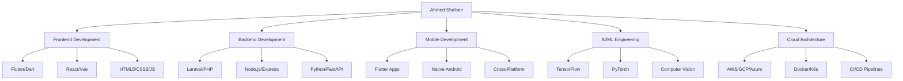

<!-- Ultimate Animated Header with 3D Effects -->
<div align="center">
  
</div>

<!-- Futuristic Terminal Animation -->
<div align="center">
  
</div>

<!-- Matrix Rain Background GIF -->
<div align="center">
  
</div>

<!-- Professional Stats Bar -->
<div align="center">
  
  [](https://github.com/Lord-shaban)
  [](https://github.com/Lord-shaban)
  [](https://github.com/Lord-shaban?tab=repositories)
  [](https://github.com/Lord-shaban)
  [](https://github.com/Lord-shaban)
  [](https://github.com/Lord-shaban)
  
</div>

<!-- Advanced GitHub Metrics Widget -->
<div align="center">
  
</div>

<!-- 3D Contribution Snake -->
<picture>
  <source media="(prefers-color-scheme: dark)" srcset="https://raw.githubusercontent.com/platane/snk/output/github-contribution-grid-snake-dark.svg">
  <source media="(prefers-color-scheme: light)" srcset="https://raw.githubusercontent.com/platane/snk/output/github-contribution-grid-snake.svg">
  
</picture>

<!-- Animated Divider -->


<!-- Hero Section with Parallax Effect -->
<h1 align="center">
  
  <b>Welcome to My Digital Empire</b>
  
</h1>

<!-- Interactive Profile Card -->
<table align="center" border="0">
<tr>
<td width="50%" align="center">


<br><br>

<!-- Animated Social Links -->
<div align="center">
  
[](https://linkedin.com/in/ahmed-shaban)
[](https://twitter.com/ahmedshaban)
[](https://instagram.com/ahmed.shaban)
[](https://youtube.com/@ahmedshaban)

</div>

</td>
<td width="50%">

###  Elite Developer Profile


```python
class AhmedShaban:
    def __init__(self):
        self.name = "Ahmed Sha'ban"
        self.role = "Full Stack Software Engineer"
        self.location = "Egypt 🇪🇬"
        self.university = "Nile University"
        self.company = "Abakera NU"
        self.languages = ["Arabic", "English"]
        
    def get_skills(self):
        return {
            "languages": ["Dart", "Python", "JavaScript", "PHP", "Java", "C++"],
            "frameworks": ["Flutter", "Laravel", "React", "Node.js"],
            "databases": ["MongoDB", "MySQL", "PostgreSQL", "Firebase"],
            "ai_ml": ["TensorFlow", "PyTorch", "Scikit-learn"],
            "cloud": ["AWS", "Google Cloud", "Azure"],
            "tools": ["Docker", "Kubernetes", "Git", "CI/CD"]
        }
    
    def get_current_projects(self):
        return ["AI-Powered Flutter Apps", "Machine Learning Models", 
                "Cloud Infrastructure", "Open Source Contributions"]
    
    def life_philosophy(self):
        return "while alive: code() && innovate() && inspire()"

me = AhmedShaban()
```

</td>
</tr>
</table>

<!-- Neon Divider -->


## 🌌 GitHub Universe Statistics

<!-- Advanced Analytics Dashboard -->
<div align="center">
  
 


<!-- 3D Activity Graph -->


</div>

<!-- GitHub Metrics Dashboard -->
<details open>
<summary>📊 <b>Advanced GitHub Metrics</b></summary>
<br>
<div align="center">
  


</div>
</details>

<!-- Trophies with Animation -->


## 🏆 Achievement Hall of Fame

<div align="center">
  
</div>

<!-- Skills Matrix -->


## 💫 Technology Matrix

<div align="center">

### 🎯 Core Technologies
[](https://skillicons.dev)

### 📈 Proficiency Levels


</div>

<!-- Projects Showcase with Preview -->


## 🚀 Flagship Projects

<div align="center">
  <table>
    <tr>
      <td width="50%">
        <h3 align="center">AI Flutter Assistant</h3>
        <div align="center">
          <a href="https://github.com/Lord-shaban/ai-flutter-assistant">
            
          </a>
          <p>
            
            
            
          </p>
        </div>
      </td>
      <td width="50%">
        <h3 align="center">Laravel Microservices</h3>
        <div align="center">
          <a href="https://github.com/Lord-shaban/laravel-microservices">
            
          </a>
          <p>
            
            
            
          </p>
        </div>
      </td>
    </tr>
    <tr>
      <td width="50%">
        <h3 align="center">Machine Learning Platform</h3>
        <div align="center">
          <a href="https://github.com/Lord-shaban/ml-platform">
            
          </a>
          <p>
            
            
            
          </p>
        </div>
      </td>
      <td width="50%">
        <h3 align="center">Cloud Native App</h3>
        <div align="center">
          <a href="https://github.com/Lord-shaban/cloud-native">
            
          </a>
          <p>
            
            
            
          </p>
        </div>
      </td>
    </tr>
  </table>
</div>

<!-- GitHub Profile Summary Cards -->
<details>
<summary>📊 <b>Comprehensive GitHub Analytics</b></summary>
<br>
<div align="center">
  
  
  <table>
    <tr>
      <td></td>
      <td></td>
    </tr>
    <tr>
      <td></td>
      <td></td>
    </tr>
  </table>
</div>
</details>

<!-- Animated Skills Section -->


## 🌟 Expertise Breakdown

<div align="center">



</div>

<!-- Certifications & Achievements -->


## 🎖️ Certifications & Recognition

<div align="center">
  <table>
    <tr>
      <td align="center">
        
      </td>
      <td align="center">
        
      </td>
    </tr>
    <tr>
      <td align="center">
        
      </td>
      <td align="center">
        
      </td>
    </tr>
    <tr>
      <td align="center">
        
      </td>
      <td align="center">
        
      </td>
    </tr>
  </table>
</div>

<!-- Competitive Programming Stats -->


## 🏅 Competitive Programming

<div align="center">
  <table>
    <tr>
      <td align="center">
        <a href="https://leetcode.com/Lord-shaban">
          
          <br>
          
        </a>
      </td>
      <td align="center">
        <a href="https://www.hackerrank.com/Lord-shaban">
          
          <br>
          
          
          
        </a>
      </td>
    </tr>
    <tr>
      <td align="center">
        <a href="https://codeforces.com/profile/Lord-shaban">
          
          <br>
          
          
        </a>
      </td>
      <td align="center">
        <a href="https://www.codechef.com/users/Lord-shaban">
          
          <br>
          
          
        </a>
      </td>
    </tr>
  </table>
</div>

<!-- Open Source Contributions -->


## 🌍 Open Source Contributions

<div align="center">
  
[](https://gist.github.com/Lord-shaban)
[](http://makeapullrequest.com)
[](https://github.com/Lord-shaban)


</div>

<!-- Coding Activity Heatmap -->
<details>
<summary>📅 <b>Coding Activity Heatmap</b></summary>
<br>
<div align="center">
  
  <br><br>
  
</div>
</details>

<!-- Latest Blog Posts & Activities -->


## 📰 Latest Activities & Blog Posts

<div align="center">
  <table>
    <tr>
      <td width="50%">
        <h3 align="center">📝 Recent Blog Posts</h3>
        
<!-- BLOG-POST-LIST:START -->
- 🔥 [Building Scalable Flutter Apps with Clean Architecture](https://dev.to/lordshaban/flutter-clean-architecture)
- 💡 [AI Integration in Mobile Apps: A Practical Guide](https://dev.to/lordshaban/ai-mobile-integration)
- 🚀 [Mastering Laravel Microservices](https://dev.to/lordshaban/laravel-microservices)
- 🎯 [Advanced State Management in Flutter](https://dev.to/lordshaban/flutter-state-management)
- ⚡ [Optimizing MongoDB for Production](https://dev.to/lordshaban/mongodb-optimization)
<!-- BLOG-POST-LIST:END -->
        
  </td>
  <td width="50%">
    <h3 align="center">🎬 Latest YouTube Videos</h3>
        
<!-- YOUTUBE:START -->
- 🎥 [Flutter + AI: Building Smart Apps](https://youtube.com/watch?v=xxx)
- 📹 [Laravel API Development Masterclass](https://youtube.com/watch?v=xxx)
- 🎬 [Cloud Architecture for Developers](https://youtube.com/watch?v=xxx)
- 📺 [Machine Learning Crash Course](https://youtube.com/watch?v=xxx)
- 🎞️ [DevOps Best Practices 2024](https://youtube.com/watch?v=xxx)
<!-- YOUTUBE:END -->
        
      </td>
    </tr>
  </table>
</div>

<!-- Interactive Connect Section -->


## 🌐 Connect & Collaborate

<div align="center">
  
<a href="https://linkedin.com/in/ahmed-shaban"></a>
<a href="https://github.com/Lord-shaban"></a>
<a href="https://twitter.com/ahmedshaban"></a>
<a href="https://instagram.com/ahmed.shaban"></a>
<a href="https://dev.to/lordshaban"></a>
<a href="https://stackoverflow.com/users/ahmedshaban"></a>
<a href="https://medium.com/@ahmedshaban"></a>
<a href="https://discord.com/users/ahmedshaban"></a>
<a href="mailto:ahmed.shaban@example.com"></a>
<a href="https://wa.me/201234567890"></a>

<br><br>

### 💰 Support My Work

<a href="https://www.buymeacoffee.com/ahmedshaban"></a>
<a href="https://paypal.me/ahmedshaban"></a>
<a href="https://patreon.com/ahmedshaban"></a>
<a href="https://ko-fi.com/ahmedshaban"></a>
<a href="https://github.com/sponsors/Lord-shaban"></a>

</div>

<!-- Motivational Quotes -->


## 💭 Daily Wisdom & Fun

<div align="center">
  
### 📜 Developer Quote


### 😄 Programming Joke
<details>
<summary>Click for today's joke!</summary>
<br>

</details>

### 🎵 Currently Listening To


### 🎮 Recent Gaming Activity


</div>

<!-- GitHub Skyline View -->
<details>
<summary>🏙️ <b>3D Contribution Skyline</b></summary>
<br>
<div align="center">
  <a href="https://skyline.github.com/Lord-shaban/2024">
    
  </a>
</div>
</details>

<!-- Footer Section with Animation -->


<div align="center">
  
</div>

<!-- Advanced Visitor Stats and Badges -->
<div align="center">
  <br>
  
  
  
  
  <br>
  
  
  
  
  
  <br><br>
  
  
  
  <br><br>
  
  <h2>
    
    Happy Coding & Keep Building Amazing Things!
    
  </h2>
  
  <b>© 2024 Ahmed Sha'ban | Crafted with 💜, ☕ and lots of <code>;</code></b>
  
</div>

<!-- Matrix End Animation -->
<div align="center">
  
</div>
