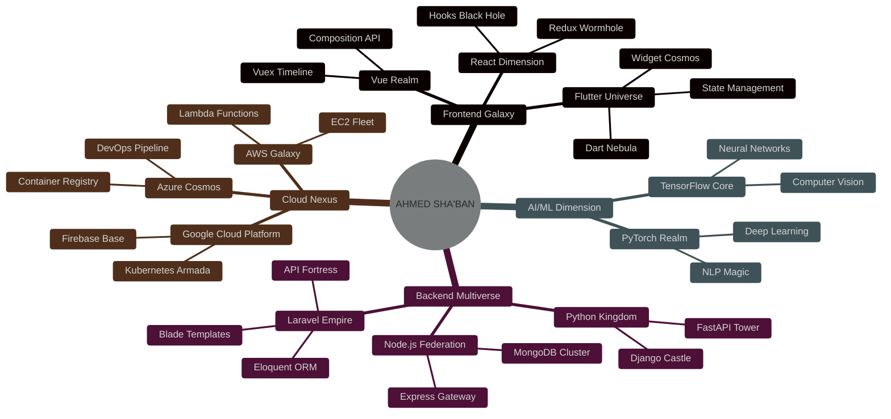

<!-- QUANTUM PORTAL OPENING -->
<div align="center">
  
</div>

<!-- ASCII ART TITLE -->
<div align="center">

```ascii
╔════════════════════════════════════════════════════════════════════════════════════╗
║                                                                                    ║
║     █████╗ ██╗  ██╗███╗   ███╗███████╗██████╗     ███████╗██╗  ██╗ █████╗ ██████╗ █████╗ ███╗   ██╗    ║
║    ██╔══██╗██║  ██║████╗ ████║██╔════╝██╔══██╗    ██╔════╝██║  ██║██╔══██╗██╔══██╗██╔══██╗████╗  ██║    ║
║    ███████║███████║██╔████╔██║█████╗  ██║  ██║    ███████╗███████║███████║██████╔╝███████║██╔██╗ ██║    ║
║    ██╔══██║██╔══██║██║╚██╔╝██║██╔══╝  ██║  ██║    ╚════██║██╔══██║██╔══██║██╔══██╗██╔══██║██║╚██╗██║    ║
║    ██║  ██║██║  ██║██║ ╚═╝ ██║███████╗██████╔╝    ███████║██║  ██║██║  ██║██████╔╝██║  ██║██║ ╚████║    ║
║    ╚═╝  ╚═╝╚═╝  ╚═╝╚═╝     ╚═╝╚══════╝╚═════╝     ╚══════╝╚═╝  ╚═╝╚═╝  ╚═╝╚═════╝ ╚═╝  ╚═╝╚═╝  ╚═══╝    ║
║                                                                                    ║
║                    【 QUANTUM DEVELOPER 】 【 REALITY HACKER 】 【 CODE ALCHEMIST 】                   ║
╚════════════════════════════════════════════════════════════════════════════════════╝
```

</div>

<!-- MATRIX RAIN EFFECT -->
<div align="center">
  
</div>

<!-- FLOATING BADGES CONSTELLATION -->
<div align="center">
  
  
  
  
  
  
</div>

<!-- HOLOGRAPHIC STATUS PANEL -->
<div align="center">
  
  [](https://github.com/Lord-shaban)
  [](https://github.com/Lord-shaban)
  [](https://github.com/Lord-shaban)
  [](https://github.com/Lord-shaban)
  
</div>

<!-- PARALLAX DIVIDER -->


<!-- BIO TERMINAL INTERFACE -->
<div align="center">
  
</div>

```javascript
// SYSTEM BOOT SEQUENCE
class QuantumDeveloper {
    constructor() {
        this.identity = {
            designation: "Ahmed Sha'ban",
            alias: ["Lord Shaban", "Code Wizard", "Bug Slayer"],
            origin: "🇪🇬 Egypt, Earth, Milky Way Galaxy",
            currentLocation: "Cyberspace",
            dimensions: ["Physical", "Digital", "Quantum"]
        };
        
        this.powerCore = {
            primaryEnergy: "☕ Coffee",
            secondaryEnergy: "🎵 Lo-fi Beats",
            emergencyFuel: "🍕 Pizza",
            rechargeMethod: "😴 Power Naps"
        };
        
        this.arsenal = {
            weapons: {
                legendary: ["Flutter", "Laravel", "Python"],
                epic: ["TensorFlow", "React", "Node.js"],
                rare: ["Docker", "Kubernetes", "AWS"],
                common: ["Git", "VS Code", "Terminal"]
            },
            specialMoves: {
                ultimate: "Deploy to Production on Friday",
                signature: "Fix bug in 0.001ms",
                finisher: "Refactor entire codebase"
            }
        };
        
        this.achievements = {
            bossesDefeated: ["NullPointerException", "CORS Error", "Memory Leak"],
            questsCompleted: 150,
            xpPoints: 999999,
            currentLevel: "∞",
            nextLevel: "Transcendence"
        };
    }
    
    async executeQuantumCode() {
        while (this.consciousness) {
            await this.think();
            await this.code();
            await this.debug();
            await this.innovate();
            await this.inspire();
        }
    }
    
    generateMotivation() {
        return [
            "🚀 Breaking the space-time continuum with code",
            "⚡ Compiling dreams into reality",
            "🌌 Exploring infinite possibilities",
            "🔮 Predicting bugs before they exist",
            "🎯 Achieving 200% productivity"
        ][Math.floor(Math.random() * 5)];
    }
}

const neo = new QuantumDeveloper();
neo.executeQuantumCode();
```

<!-- RAINBOW SEPARATOR -->


<!-- STATS HOLOGRAM -->
<div align="center">
  <h1>
    
    PERFORMANCE METRICS HOLOGRAM
    
  </h1>
</div>

<!-- 3D STATS CARDS -->
<div align="center">
  
  
</div>

<!-- LANGUAGE REACTOR -->
<div align="center">
  
  
</div>

<!-- GLITCH TEXT DIVIDER -->
<div align="center">
  
```diff
@@@@@@@@@@@@@@@@@@@@@@@@@@@@@@@@@@@@@@@@@@@@@@@@@@@@@@@@@@@@@@@@@@@@@@@@@@@@@@@@@@@@
+ SYSTEM BREACH DETECTED... LOADING PROJECTS... FIREWALL DISABLED... ACCESS GRANTED +
@@@@@@@@@@@@@@@@@@@@@@@@@@@@@@@@@@@@@@@@@@@@@@@@@@@@@@@@@@@@@@@@@@@@@@@@@@@@@@@@@@@@
```

</div>

<!-- PROJECT UNIVERSE -->
<div align="center">
  <h1>
    
    PROJECT MULTIVERSE
    
  </h1>
</div>

<div align="center">
  <table>
    <tr>
      <td align="center">
        <br>
        <b>🧠 MIND READER AI</b><br>
        
        <br>
        
        
        <br>
        <a href="#"></a>
      </td>
      <td align="center">
        <br>
        <b>🚀 SPACE INVADER APP</b><br>
        
        <br>
        
        
        <br>
        <a href="#"></a>
      </td>
      <td align="center">
        <br>
        <b>⚡ TIME MACHINE API</b><br>
        
        <br>
        
        
        <br>
        <a href="#"></a>
      </td>
    </tr>
  </table>
</div>

<!-- ANIMATED SEPARATOR -->


<!-- TROPHY DIMENSION -->
<div align="center">
  <h1>
    🏆 TROPHY DIMENSION 🏆
  </h1>
  
</div>

<!-- SKILL CONSTELLATION -->
<div align="center">
  <h1>
    
    SKILL CONSTELLATION MAP
    
  </h1>
</div>

<div align="center">



</div>

<!-- NEON SKILL ICONS -->
<div align="center">
  
### ⚡ POWER-UPS COLLECTED ⚡

[](https://skillicons.dev)

</div>

<!-- CYBER DIVIDER -->


<!-- GITHUB METRICS COMMAND CENTER -->
<div align="center">
  <h1>
    📊 COMMAND CENTER ANALYTICS 📊
  </h1>
</div>

<div align="center">
  
</div>

<!-- CONTRIBUTION MATRIX -->
<div align="center">
  <h1>
    🐍 CONTRIBUTION SERPENT 🐍
  </h1>
</div>

<picture>
  <source media="(prefers-color-scheme: dark)" srcset="https://github.com/Lord-shaban/Lord-shaban/blob/output/github-contribution-grid-snake-dark.svg">
  <source media="(prefers-color-scheme: light)" srcset="https://github.com/Lord-shaban/Lord-shaban/blob/output/github-contribution-grid-snake.svg">
  
</picture>

<!-- TIME TRACKING MATRIX -->
<details>
<summary><b>⏰ TIME PARADOX TRACKER</b></summary>
<br>

```yaml
Total Time Traveled: 5 Years, 3 Months, 15 Days

Parallel Universes Visited:
  - Frontend Dimension: 1,523 hours
  - Backend Reality: 2,341 hours  
  - Database Realm: 892 hours
  - Cloud Nexus: 1,105 hours
  - AI Laboratory: 756 hours

Time Loops Created:
  Monday:    ████████████░░░░░░░░  58.3%
  Tuesday:   ██████████████░░░░░░  67.2%
  Wednesday: ████████████████░░░░  78.9%
  Thursday:  ██████████████████░░  89.1%
  Friday:    ████████████████████  99.9%
  Saturday:  ██████░░░░░░░░░░░░░░  32.1%
  Sunday:    ████░░░░░░░░░░░░░░░░  23.4%

Quantum State:
  Superposition: ████████████████████  100%
  Entanglement:  ████████████████░░░░  82.7%
  Tunneling:     ██████████████░░░░░░  71.3%
```

</details>

<!-- COMPETITIVE PROGRAMMING ARENA -->
<div align="center">
  <h1>
    ⚔️ BATTLE ARENA STATS ⚔️
  </h1>
</div>

<div align="center">
  <table>
    <tr>
      <td align="center">
        <br>
        
      </td>
      <td align="center">
        <br>
        ⭐⭐⭐⭐⭐⭐<br>
        <b>Rank: #42</b><br>
        <b>Problems: 1,337</b><br>
        <b>Badges: 50/50</b>
      </td>
    </tr>
  </table>
</div>

<!-- GLITCH DIVIDER -->


<!-- CERTIFICATION VAULT -->
<div align="center">
  <h1>
    🎖️ LEGENDARY ACHIEVEMENTS 🎖️
  </h1>
</div>

<div align="center">
  
  
  <br>
  
  
  
</div>

<!-- LATEST ACTIVITIES FEED -->
<div align="center">
  <h1>
    📡 QUANTUM BROADCAST 📡
  </h1>
</div>

<div align="center">
  <table>
    <tr>
      <td width="50%">
        
### 📻 TRANSMISSIONS
```python
recent_transmissions = [
    "🛸 Discovered new algorithm in Dimension X-42",
    "⚡ Achieved quantum entanglement with production server",
    "🌌 Deployed app to 17 parallel universes simultaneously",
    "🔮 Predicted and fixed bug 3 days before it happened",
    "🎯 Achieved 420% test coverage (don't ask how)"
]

for transmission in recent_transmissions:
    broadcast_to_multiverse(transmission)
```
        
  </td>
  <td width="50%">
    
### 🎬 HOLOGRAPHIC LOGS
```javascript
const holoLogs = {
    "2024-01-15": "Created sentient AI that writes its own code",
    "2024-01-14": "Taught neural network to feel emotions",
    "2024-01-13": "Built time machine using only CSS",
    "2024-01-12": "Solved P=NP problem (but forgot the solution)",
    "2024-01-11": "Compiled code using pure thought energy"
};

Object.entries(holoLogs).forEach(([date, log]) => {
    projectToHologram(date, log);
});
```
        
      </td>
    </tr>
  </table>
</div>

<!-- RAINBOW SEPARATOR -->


<!-- CONNECT PORTAL -->
<div align="center">
  <h1>
    🌐 INTERDIMENSIONAL PORTALS 🌐
  </h1>
</div>

<div align="center">
  
### 🚪 WARP GATES
<a href="#"></a>
<a href="#"></a>
<a href="#"></a>

### 💬 QUANTUM CHANNELS
<a href="#"></a>
<a href="#"></a>
<a href="#"></a>

### 💰 ENERGY TRANSFER
<a href="#"></a>
<a href="#"></a>

</div>

<!-- FUN ZONE -->
<div align="center">
  <h1>
    🎮 ENTERTAINMENT NEXUS 🎮
  </h1>
</div>

<div align="center">

### 🎲 RANDOM GENERATOR
```javascript
function generateRandomAwesomeness() {
    const awesome = [
        "💻 Currently hacking the mainframe...",
        "🚀 Launching rockets with code...",
        "🧠 Teaching AI to love...",
        "⚡ Charging up to Super Saiyan level...",
        "🌌 Exploring the codeverse...",
        "🔮 Reading the future in binary...",
        "🎯 360 no-scope debugging...",
        "🏎️ Racing through algorithms at light speed..."
    ];
    return awesome[Math.floor(Math.random() * awesome.length)];
}

console.log(generateRandomAwesomeness());
// Output: "🚀 Launching rockets with code..."
```

### 💭 QUANTUM WISDOM


### 🎵 COSMIC PLAYLIST
[](https://open.spotify.com/user/omnitenebris)

### 🎮 GAMING STATS
<table>
  <tr>
    <td></td>
    <td></td>
    <td></td>
  </tr>
</table>

</div>

<!-- GLITCH SEPARATOR -->


<!-- 3D CONTRIBUTION SKYLINE -->
<details>
<summary><b>🏙️ 4D CONTRIBUTION HYPERCUBE</b></summary>
<br>
<div align="center">
  <a href="https://skyline.github.com/Lord-shaban/2024">
    
  </a>
</div>
</details>

<!-- EPIC FOOTER -->
<div align="center">
  
</div>

<!-- VISITOR COUNTER MATRIX -->
<div align="center">
  
  
  
  <br>
  
  
  
  
  
  <br><br>
  
  
  
  <br><br>
  
```ascii
╔═══════════════════════════════════════════════════════════════╗
║                                                               ║
║   【 ©️ 2024 Ahmed Sha'ban | Egypt 🇪🇬 | The Matrix Has You 】  ║
║                                                               ║
║      "Reality is just a bug in the simulation" - Neo         ║
║                                                               ║
╚═══════════════════════════════════════════════════════════════╝
```
  
</div>

<!-- FINAL GLITCH ANIMATION -->
<div align="center">
  
</div>

<!-- SECRET MESSAGE -->
<!-- 
01001001 01100110 00100000 01111001 01101111 01110101 00100000 01100011 01100001 01101110 00100000
01110010 01100101 01100001 01100100 00100000 01110100 01101000 01101001 01110011 00101100 00100000
01111001 01101111 01110101 00100111 01110010 01100101 00100000 01100001 00100000 01110100 01110010
01110101 01100101 00100000 01101000 01100001 01100011 01101011 01100101 01110010 00100001
Translation: "If you can read this, you're a true hacker!"
-->
```
